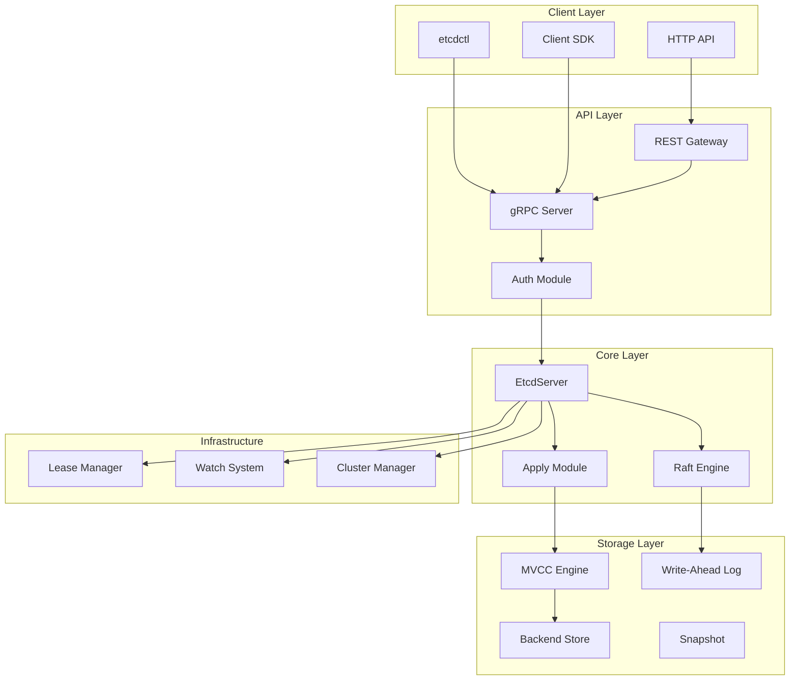
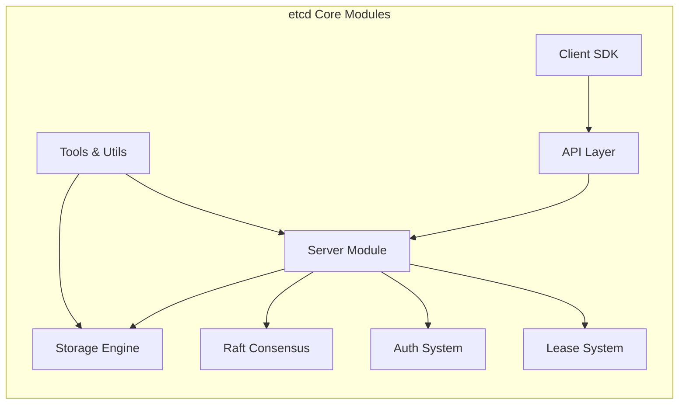

# etcd 项目架构分析与深度文档

## 概述

本文档集合提供了 etcd 分布式键值存储系统的全面架构分析和深度技术文档。通过结合源码分析，为每个核心模块提供了详细的实现原理、设计思路和最佳实践指南。

## 文档结构

### 📋 架构概览
- **[architecture-overview.md](./architecture-overview.md)** - etcd 整体架构概览
  - 系统架构图
  - 核心模块组成
  - 数据流分析
  - 关键特性介绍

### 🔧 核心模块深度分析

#### 服务端模块
- **[server-module-deep-dive.md](./server-module-deep-dive.md)** - Server 模块深度分析
  - EtcdServer 核心结构
  - Raft 集成实现
  - 请求处理流程
  - 应用状态机
  - 集群管理机制

#### 存储引擎
- **[storage-engine-analysis.md](./storage-engine-analysis.md)** - 存储引擎深度分析
  - MVCC 多版本并发控制
  - Backend 存储实现
  - 索引管理机制
  - WAL 预写日志
  - 快照和压缩机制

#### 一致性算法
- **[raft-consensus-implementation.md](./raft-consensus-implementation.md)** - Raft 一致性算法实现
  - Raft 算法基础
  - 领导者选举流程
  - 日志复制机制
  - 快照处理
  - 网络传输层
  - 性能优化策略

### 🔌 客户端与 API

#### 客户端 SDK
- **[client-sdk-guide.md](./client-sdk-guide.md)** - 客户端 SDK 使用指南
  - 客户端架构设计
  - 核心接口实现
  - KV、Watch、Lease 操作
  - 事务处理
  - 高级特性（负载均衡、重试）
  - 最佳实践

#### API 参考
- **[api-reference-guide.md](./api-reference-guide.md)** - API 参考指南
  - gRPC 服务定义
  - HTTP API 端点
  - 数据格式规范
  - 错误处理机制
  - 性能考虑

### 🔐 安全与管理

#### 认证安全
- **[auth-security-system.md](./auth-security-system.md)** - 认证安全系统
  - RBAC 权限模型
  - 用户和角色管理
  - 令牌管理（Simple Token、JWT）
  - TLS 配置
  - 安全最佳实践

#### 租约管理
- **[lease-management-system.md](./lease-management-system.md)** - 租约管理系统
  - 租约生命周期
  - 优先队列实现
  - 检查点机制
  - 键值关联
  - 性能优化
  - 应用场景

### 🛠️ 工具与优化

#### 工具指南
- **[tools-utilities-guide.md](./tools-utilities-guide.md)** - 工具和实用程序指南
  - etcdctl 客户端工具
  - etcdutl 数据库工具
  - 性能测试工具
  - 诊断和调试工具
  - 脚本和自动化
  - 故障排除

#### 性能优化
- **[performance-optimization.md](./performance-optimization.md)** - 性能优化指南
  - 硬件配置优化
  - 软件参数调优
  - 应用层优化
  - 集群架构设计
  - 监控和调优
  - 故障排除

## 架构图表

### 整体架构

### 模块关系

## 技术特点

### 🎯 核心特性
- **强一致性** - 基于 Raft 算法的分布式一致性
- **高可用性** - 支持集群部署和自动故障恢复
- **ACID 事务** - 完整的事务支持和 MVCC
- **监听机制** - 实时数据变更通知
- **租约管理** - 键值对生命周期管理

### 🔧 技术亮点
- **MVCC 存储** - 多版本并发控制
- **WAL 日志** - 预写日志保证数据持久性
- **gRPC API** - 高性能的 RPC 通信
- **TLS 加密** - 端到端安全通信
- **RBAC 权限** - 基于角色的访问控制

### 📊 性能指标
- **写入延迟** - < 10ms (P99)
- **读取延迟** - < 1ms (P99)
- **写入吞吐量** - 10,000+ ops/sec
- **读取吞吐量** - 100,000+ ops/sec

## 使用场景

### 🌐 分布式系统
- **配置管理** - 集中化配置存储和分发
- **服务发现** - 服务注册和健康检查
- **分布式锁** - 基于租约的分布式锁实现
- **领导者选举** - 分布式系统中的领导者选举

### ☸️ Kubernetes 集成
- **集群状态存储** - Kubernetes 的后端存储
- **资源版本管理** - 资源变更追踪
- **事件通知** - 资源变更事件分发

## 学习路径

### 🚀 入门阶段
1. 阅读 [architecture-overview.md](./architecture-overview.md) 了解整体架构
2. 学习 [client-sdk-guide.md](./client-sdk-guide.md) 掌握基本使用
3. 实践 [tools-utilities-guide.md](./tools-utilities-guide.md) 中的工具使用

### 🔍 深入阶段
1. 研究 [server-module-deep-dive.md](./server-module-deep-dive.md) 理解服务端实现
2. 分析 [storage-engine-analysis.md](./storage-engine-analysis.md) 掌握存储原理
3. 学习 [raft-consensus-implementation.md](./raft-consensus-implementation.md) 理解一致性算法

### 🎯 高级阶段
1. 掌握 [auth-security-system.md](./auth-security-system.md) 安全机制
2. 理解 [lease-management-system.md](./lease-management-system.md) 租约系统
3. 应用 [performance-optimization.md](./performance-optimization.md) 性能优化

## 贡献指南

### 📝 文档维护
- 文档使用 Markdown 格式编写
- 图表使用 Mermaid 语法
- 代码示例包含完整的上下文
- 保持中文注释和英文文件名

### 🔄 更新流程
1. 基于最新源码更新文档内容
2. 验证代码示例的正确性
3. 更新架构图和流程图
4. 补充最佳实践和使用案例

## 参考资源

### 📚 官方文档
- [etcd 官方文档](https://etcd.io/docs/)
- [etcd GitHub 仓库](https://github.com/etcd-io/etcd)
- [Raft 算法论文](https://raft.github.io/raft.pdf)

### 🛠️ 开发工具
- [etcdctl](https://github.com/etcd-io/etcd/tree/main/etcdctl)
- [etcdutl](https://github.com/etcd-io/etcd/tree/main/etcdutl)
- [Prometheus 监控](https://prometheus.io/)

---

**注意**: 本文档集合基于 etcd 最新版本的源码分析编写，旨在提供深入的技术理解和实践指导。建议结合实际项目需求和官方文档进行学习和应用。
