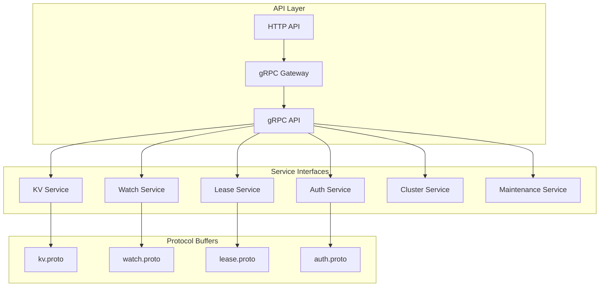

# etcd API 参考指南

## 概述

etcd 提供了完整的 gRPC 和 HTTP API，支持键值操作、监听、租约管理、集群管理等功能。本文将详细介绍 etcd API 的设计和使用方法。

## API 架构



## 核心 API 服务

### 1. KV Service

**位置**: `api/etcdserverpb/rpc.proto`

<augment_code_snippet path="api/etcdserverpb/rpc.proto" mode="EXCERPT">
````proto
service KV {
  // Range 获取键值对
  rpc Range(RangeRequest) returns (RangeResponse) {}

  // Put 存储键值对
  rpc Put(PutRequest) returns (PutResponse) {}

  // DeleteRange 删除键值对
  rpc DeleteRange(DeleteRangeRequest) returns (DeleteRangeResponse) {}

  // Txn 处理事务
  rpc Txn(TxnRequest) returns (TxnResponse) {}

  // Compact 压缩历史版本
  rpc Compact(CompactionRequest) returns (CompactionResponse) {}
}
````
</augment_code_snippet>

#### Range 操作

**请求格式**:
```proto
message RangeRequest {
  bytes key = 1;           // 查询的键
  bytes range_end = 2;     // 范围结束键
  int64 limit = 3;         // 限制返回数量
  int64 revision = 4;      // 指定版本
  int64 sort_order = 5;    // 排序顺序
  int64 sort_target = 6;   // 排序目标
  bool serializable = 7;   // 是否可序列化读
  bool keys_only = 8;      // 只返回键
  bool count_only = 9;     // 只返回计数
  int64 min_mod_revision = 10;  // 最小修改版本
  int64 max_mod_revision = 11;  // 最大修改版本
  int64 min_create_revision = 12; // 最小创建版本
  int64 max_create_revision = 13; // 最大创建版本
}
```

**响应格式**:
```proto
message RangeResponse {
  ResponseHeader header = 1;
  repeated mvccpb.KeyValue kvs = 2;  // 键值对列表
  bool more = 3;                     // 是否有更多数据
  int64 count = 4;                   // 总数量
}
```

#### Put 操作

**请求格式**:
```proto
message PutRequest {
  bytes key = 1;        // 键
  bytes value = 2;      // 值
  int64 lease = 3;      // 租约ID
  bool prev_kv = 4;     // 返回前一个值
  bool ignore_value = 5; // 忽略值
  bool ignore_lease = 6; // 忽略租约
}
```

#### 事务操作

<augment_code_snippet path="api/etcdserverpb/rpc.proto" mode="EXCERPT">
````proto
message TxnRequest {
  repeated Compare compare = 1;    // 比较条件
  repeated RequestOp success = 2;  // 成功时执行的操作
  repeated RequestOp failure = 3;  // 失败时执行的操作
}

message Compare {
  enum CompareResult {
    EQUAL = 0;
    GREATER = 1;
    LESS = 2;
    NOT_EQUAL = 3;
  }
  
  enum CompareTarget {
    VERSION = 0;
    CREATE = 1;
    MOD = 2;
    VALUE = 3;
    LEASE = 4;
  }
  
  CompareResult result = 1;
  CompareTarget target = 2;
  bytes key = 3;
  oneof target_union {
    int64 version = 4;
    int64 create_revision = 5;
    int64 mod_revision = 6;
    bytes value = 7;
    int64 lease = 8;
  }
  bytes range_end = 64;
}
````
</augment_code_snippet>

### 2. Watch Service

**监听服务定义**:

```proto
service Watch {
  // Watch 监听键的变化
  rpc Watch(stream WatchRequest) returns (stream WatchResponse) {}
}

message WatchRequest {
  oneof request_union {
    WatchCreateRequest create_request = 1;
    WatchCancelRequest cancel_request = 2;
    WatchProgressRequest progress_request = 3;
  }
}

message WatchCreateRequest {
  bytes key = 1;              // 监听的键
  bytes range_end = 2;        // 范围结束键
  int64 start_revision = 3;   // 开始版本
  bool progress_notify = 4;   // 进度通知
  repeated FilterType filters = 5; // 过滤器
  bool prev_kv = 6;          // 返回前一个值
  int64 watch_id = 7;        // 监听ID
  bool fragment = 8;         // 分片
}
```

**监听响应**:

```proto
message WatchResponse {
  ResponseHeader header = 1;
  int64 watch_id = 2;
  bool created = 3;           // 是否新创建
  bool canceled = 4;          // 是否被取消
  int64 compact_revision = 5; // 压缩版本
  string cancel_reason = 6;   // 取消原因
  bool fragment = 7;          // 是否分片
  repeated mvccpb.Event events = 11; // 事件列表
}
```

### 3. Lease Service

**租约服务定义**:

```proto
service Lease {
  // LeaseGrant 创建租约
  rpc LeaseGrant(LeaseGrantRequest) returns (LeaseGrantResponse) {}

  // LeaseRevoke 撤销租约
  rpc LeaseRevoke(LeaseRevokeRequest) returns (LeaseRevokeResponse) {}

  // LeaseKeepAlive 保持租约活跃
  rpc LeaseKeepAlive(stream LeaseKeepAliveRequest) returns (stream LeaseKeepAliveResponse) {}

  // LeaseTimeToLive 获取租约剩余时间
  rpc LeaseTimeToLive(LeaseTimeToLiveRequest) returns (LeaseTimeToLiveResponse) {}

  // LeaseLeases 列出所有租约
  rpc LeaseLeases(LeaseLeasesRequest) returns (LeaseLeasesResponse) {}
}
```

**租约创建**:

```proto
message LeaseGrantRequest {
  int64 TTL = 1;  // 生存时间（秒）
  int64 ID = 2;   // 租约ID（可选）
}

message LeaseGrantResponse {
  ResponseHeader header = 1;
  int64 ID = 2;    // 租约ID
  int64 TTL = 3;   // 实际TTL
  string error = 4; // 错误信息
}
```

### 4. Auth Service

**认证服务定义**:

```proto
service Auth {
  // AuthEnable 启用认证
  rpc AuthEnable(AuthEnableRequest) returns (AuthEnableResponse) {}

  // AuthDisable 禁用认证
  rpc AuthDisable(AuthDisableRequest) returns (AuthDisableResponse) {}

  // Authenticate 用户认证
  rpc Authenticate(AuthenticateRequest) returns (AuthenticateResponse) {}

  // UserAdd 添加用户
  rpc UserAdd(AuthUserAddRequest) returns (AuthUserAddResponse) {}

  // UserGet 获取用户信息
  rpc UserGet(AuthUserGetRequest) returns (AuthUserGetResponse) {}

  // UserList 列出所有用户
  rpc UserList(AuthUserListRequest) returns (AuthUserListResponse) {}

  // UserDelete 删除用户
  rpc UserDelete(AuthUserDeleteRequest) returns (AuthUserDeleteResponse) {}

  // UserChangePassword 修改密码
  rpc UserChangePassword(AuthUserChangePasswordRequest) returns (AuthUserChangePasswordResponse) {}

  // UserGrantRole 授予角色
  rpc UserGrantRole(AuthUserGrantRoleRequest) returns (AuthUserGrantRoleResponse) {}

  // UserRevokeRole 撤销角色
  rpc UserRevokeRole(AuthUserRevokeRoleRequest) returns (AuthUserRevokeRoleResponse) {}

  // RoleAdd 添加角色
  rpc RoleAdd(AuthRoleAddRequest) returns (AuthRoleAddResponse) {}

  // RoleGet 获取角色信息
  rpc RoleGet(AuthRoleGetRequest) returns (AuthRoleGetResponse) {}

  // RoleList 列出所有角色
  rpc RoleList(AuthRoleListRequest) returns (AuthRoleListResponse) {}

  // RoleDelete 删除角色
  rpc RoleDelete(AuthRoleDeleteRequest) returns (AuthRoleDeleteResponse) {}

  // RoleGrantPermission 授予权限
  rpc RoleGrantPermission(AuthRoleGrantPermissionRequest) returns (AuthRoleGrantPermissionResponse) {}

  // RoleRevokePermission 撤销权限
  rpc RoleRevokePermission(AuthRoleRevokePermissionRequest) returns (AuthRoleRevokePermissionResponse) {}
}
```

### 5. Cluster Service

**集群管理服务**:

```proto
service Cluster {
  // MemberAdd 添加成员
  rpc MemberAdd(MemberAddRequest) returns (MemberAddResponse) {}

  // MemberRemove 移除成员
  rpc MemberRemove(MemberRemoveRequest) returns (MemberRemoveResponse) {}

  // MemberUpdate 更新成员
  rpc MemberUpdate(MemberUpdateRequest) returns (MemberUpdateResponse) {}

  // MemberList 列出所有成员
  rpc MemberList(MemberListRequest) returns (MemberListResponse) {}

  // MemberPromote 提升学习者为投票成员
  rpc MemberPromote(MemberPromoteRequest) returns (MemberPromoteResponse) {}
}
```

## HTTP API

### 1. REST 端点

etcd 通过 gRPC Gateway 提供 HTTP API：

```
POST /v3/kv/range          # 查询键值
POST /v3/kv/put            # 存储键值
POST /v3/kv/deleterange    # 删除键值
POST /v3/kv/txn            # 事务操作
POST /v3/kv/compaction     # 压缩操作

POST /v3/watch             # 监听变化

POST /v3/lease/grant       # 创建租约
POST /v3/lease/revoke      # 撤销租约
POST /v3/lease/keepalive   # 保持活跃
POST /v3/lease/timetolive  # 获取剩余时间

POST /v3/auth/enable       # 启用认证
POST /v3/auth/disable      # 禁用认证
POST /v3/auth/authenticate # 用户认证

POST /v3/cluster/member/add    # 添加成员
POST /v3/cluster/member/remove # 移除成员
POST /v3/cluster/member/list   # 列出成员
```

### 2. HTTP 请求示例

**存储键值**:
```bash
curl -L http://localhost:2379/v3/kv/put \
  -X POST -d '{"key":"Zm9v","value":"YmFy"}'
```

**查询键值**:
```bash
curl -L http://localhost:2379/v3/kv/range \
  -X POST -d '{"key":"Zm9v"}'
```

**监听变化**:
```bash
curl -N http://localhost:2379/v3/watch \
  -X POST -d '{"create_request":{"key":"Zm9v"}}'
```

## 数据格式

### 1. 键值对结构

<augment_code_snippet path="api/mvccpb/kv.proto" mode="EXCERPT">
````proto
message KeyValue {
  bytes key = 1;                // 键
  int64 create_revision = 2;    // 创建版本
  int64 mod_revision = 3;       // 修改版本
  int64 version = 4;            // 版本号
  bytes value = 5;              // 值
  int64 lease = 6;              // 租约ID
}
````
</augment_code_snippet>

### 2. 事件结构

```proto
message Event {
  enum EventType {
    PUT = 0;     // 创建/更新事件
    DELETE = 1;  // 删除事件
  }
  
  EventType type = 1;    // 事件类型
  KeyValue kv = 2;       // 当前键值对
  KeyValue prev_kv = 3;  // 前一个键值对
}
```

### 3. 响应头结构

```proto
message ResponseHeader {
  uint64 cluster_id = 1;    // 集群ID
  uint64 member_id = 2;     // 成员ID
  int64 revision = 3;       // 当前版本
  uint64 raft_term = 4;     // Raft任期
}
```

## API 使用模式

### 1. 原子操作

```json
{
  "compare": [
    {
      "result": "EQUAL",
      "target": "VALUE",
      "key": "Zm9v",
      "value": "YmFy"
    }
  ],
  "success": [
    {
      "request_put": {
        "key": "Zm9v",
        "value": "YmF6"
      }
    }
  ],
  "failure": [
    {
      "request_range": {
        "key": "Zm9v"
      }
    }
  ]
}
```

### 2. 范围查询

```json
{
  "key": "Zm9v",
  "range_end": "Zm9w",
  "limit": 10,
  "sort_order": "ASCEND",
  "sort_target": "KEY"
}
```

### 3. 前缀监听

```json
{
  "create_request": {
    "key": "Zm9v",
    "range_end": "Zm9w",
    "start_revision": 1,
    "progress_notify": true
  }
}
```

## 错误处理

### 1. 错误码

```proto
enum ErrorType {
  OK = 0;
  CANCELLED = 1;
  UNKNOWN = 2;
  INVALID_ARGUMENT = 3;
  DEADLINE_EXCEEDED = 4;
  NOT_FOUND = 5;
  ALREADY_EXISTS = 6;
  PERMISSION_DENIED = 7;
  RESOURCE_EXHAUSTED = 8;
  FAILED_PRECONDITION = 9;
  ABORTED = 10;
  OUT_OF_RANGE = 11;
  UNIMPLEMENTED = 12;
  INTERNAL = 13;
  UNAVAILABLE = 14;
  DATA_LOSS = 15;
  UNAUTHENTICATED = 16;
}
```

### 2. 常见错误

- `ErrKeyNotFound` - 键不存在
- `ErrCompacted` - 版本已被压缩
- `ErrFutureRev` - 请求的版本太新
- `ErrNoSpace` - 存储空间不足
- `ErrTooManyOps` - 操作数量过多

## 性能考虑

### 1. 批量操作

使用事务进行批量操作以提高性能：

```json
{
  "success": [
    {"request_put": {"key": "a", "value": "1"}},
    {"request_put": {"key": "b", "value": "2"}},
    {"request_put": {"key": "c", "value": "3"}}
  ]
}
```

### 2. 分页查询

对于大量数据，使用分页查询：

```json
{
  "key": "prefix",
  "range_end": "prefiy",
  "limit": 100,
  "sort_order": "ASCEND"
}
```

### 3. 监听优化

- 使用适当的过滤器减少不必要的事件
- 合理设置监听范围
- 及时取消不需要的监听

## 总结

etcd API 设计具有以下特点：

1. **完整性** - 涵盖所有核心功能
2. **一致性** - 统一的接口设计
3. **灵活性** - 丰富的选项和参数
4. **性能** - 支持批量操作和流式处理
5. **可扩展性** - 基于 Protocol Buffers 的可扩展格式

通过合理使用这些 API，可以构建高效、可靠的分布式应用程序。
