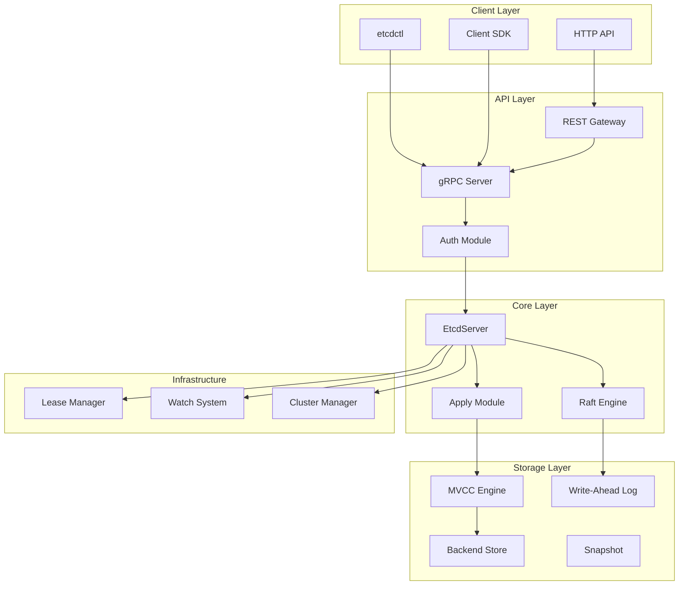
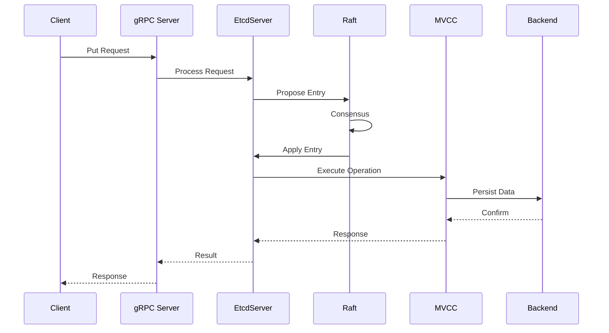
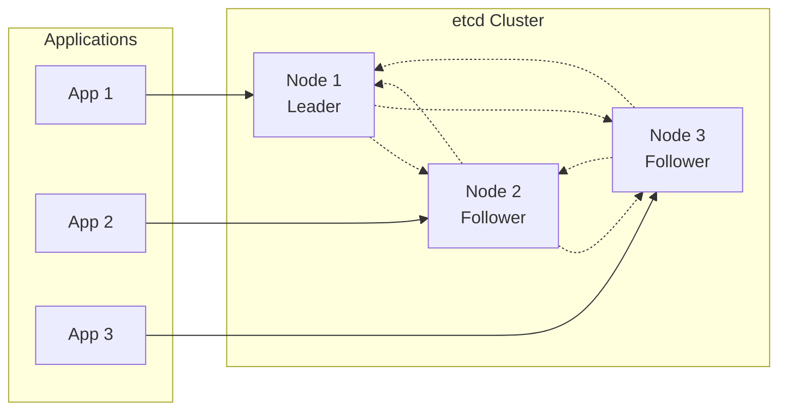

# etcd 架构概览

## 简介

etcd 是一个高可用的分布式键值存储系统，主要用于配置管理、服务发现和分布式协调。它基于 Raft 一致性算法，提供强一致性保证。

## 整体架构

## 核心模块组成

### 1. 服务端模块 (Server)

**位置**: `server/`

**核心组件**:
- `etcdserver/` - 主服务器逻辑
- `embed/` - 嵌入式服务器配置
- `etcdmain/` - 主程序入口

**主要功能**:
- 处理客户端请求
- 管理集群状态
- 协调 Raft 一致性
- 提供 gRPC 和 HTTP 服务

### 2. 存储模块 (Storage)

**位置**: `server/storage/`

**核心组件**:
- `mvcc/` - 多版本并发控制
- `backend/` - 底层存储引擎 (BoltDB)
- `wal/` - 预写日志
- `datadir/` - 数据目录管理

**主要功能**:
- 提供 ACID 事务支持
- 实现多版本存储
- 管理数据持久化
- 支持快照和恢复

### 3. 客户端模块 (Client)

**位置**: `client/`

**核心组件**:
- `v3/` - v3 API 客户端
- `pkg/` - 通用客户端包

**主要功能**:
- 提供 Go 语言 SDK
- 支持 KV、Watch、Lease、Auth 操作
- 实现连接管理和负载均衡
- 提供重试和故障转移机制

### 4. API 模块

**位置**: `api/`

**核心组件**:
- `etcdserverpb/` - gRPC 服务定义
- `mvccpb/` - MVCC 相关消息
- `v3rpc/` - v3 RPC 类型定义

**主要功能**:
- 定义 gRPC 接口
- 提供 Protocol Buffers 消息格式
- 支持 REST API 网关

### 5. 认证模块 (Auth)

**位置**: `server/auth/`

**核心组件**:
- `store.go` - 认证存储
- `jwt.go` - JWT 令牌处理
- `simple_token.go` - 简单令牌

**主要功能**:
- 用户和角色管理
- 权限控制
- 令牌生成和验证

### 6. 租约模块 (Lease)

**位置**: `server/lease/`

**核心组件**:
- `lessor.go` - 租约管理器
- `lease.go` - 租约实现

**主要功能**:
- 管理键的生命周期
- 提供 TTL 支持
- 实现租约续期机制

### 7. 工具模块

**位置**: `etcdctl/`, `etcdutl/`

**主要功能**:
- `etcdctl` - 命令行客户端工具
- `etcdutl` - 数据库维护工具

## 数据流架构

## 关键特性

### 1. 强一致性
- 基于 Raft 算法实现
- 保证线性化读写
- 支持事务操作

### 2. 高可用性
- 支持集群部署
- 自动故障检测和恢复
- 数据复制和同步

### 3. 可靠性
- 预写日志 (WAL)
- 定期快照
- 数据校验和恢复

### 4. 性能优化
- MVCC 多版本控制
- 批量操作支持
- 压缩和清理机制

## 部署架构

## 总结

etcd 采用分层架构设计，各模块职责清晰，通过 Raft 算法保证数据一致性，通过 MVCC 提供高性能的并发访问能力。其设计充分考虑了分布式系统的各种挑战，是一个成熟可靠的分布式存储解决方案。

下一步我们将深入分析各个核心模块的实现细节。
