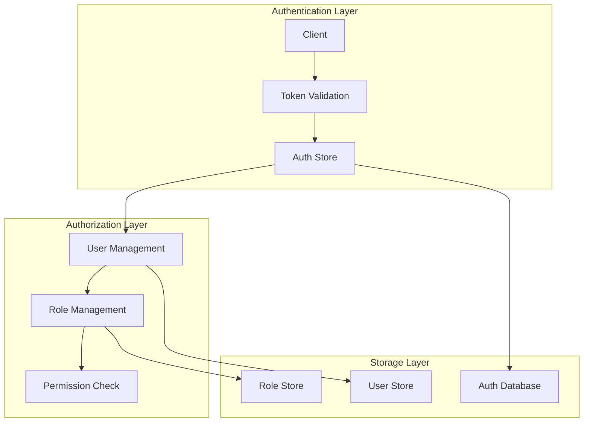
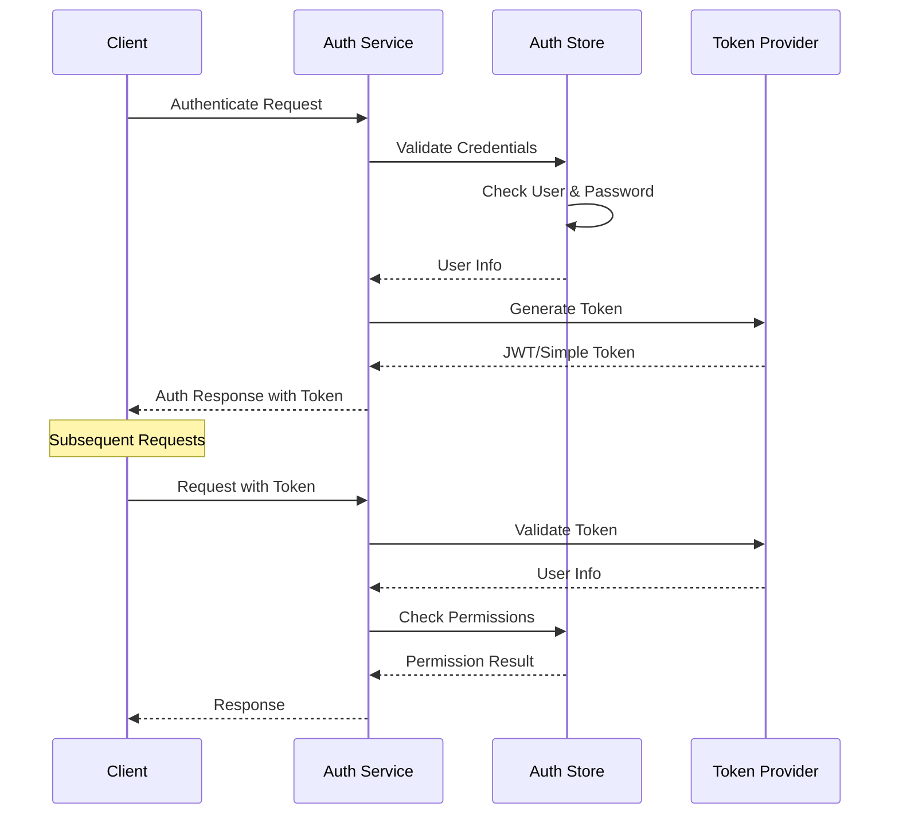
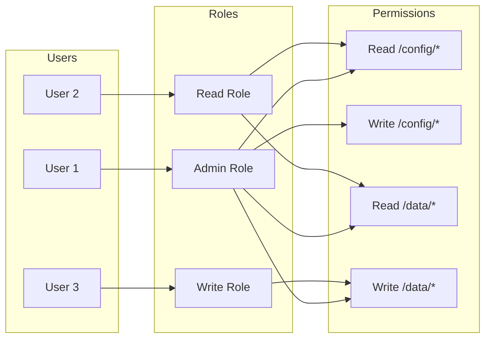

# etcd 认证安全系统

## 概述

etcd 提供了完整的认证和授权机制，支持基于角色的访问控制（RBAC），确保集群数据的安全性。本文将深入分析 etcd 认证安全系统的设计和实现。

## 安全架构



## 核心组件

### 1. Auth Store

**位置**: `server/auth/store.go`

<augment_code_snippet path="server/auth/store.go" mode="EXCERPT">
````go
type AuthStore interface {
    // 认证相关
    AuthEnable() error
    AuthDisable() error
    IsAuthEnabled() bool
    Authenticate(ctx context.Context, username, password string) (*pb.AuthenticateResponse, error)
    
    // 用户管理
    UserAdd(r *pb.AuthUserAddRequest) (*pb.AuthUserAddResponse, error)
    UserDelete(r *pb.AuthUserDeleteRequest) (*pb.AuthUserDeleteResponse, error)
    UserChangePassword(r *pb.AuthUserChangePasswordRequest) (*pb.AuthUserChangePasswordResponse, error)
    UserGrantRole(r *pb.AuthUserGrantRoleRequest) (*pb.AuthUserGrantRoleResponse, error)
    UserGet(r *pb.AuthUserGetRequest) (*pb.AuthUserGetResponse, error)
    UserRevokeRole(r *pb.AuthUserRevokeRoleRequest) (*pb.AuthUserRevokeRoleResponse, error)
    UserList(r *pb.AuthUserListRequest) (*pb.AuthUserListResponse, error)
    
    // 角色管理
    RoleAdd(r *pb.AuthRoleAddRequest) (*pb.AuthRoleAddResponse, error)
    RoleGrantPermission(r *pb.AuthRoleGrantPermissionRequest) (*pb.AuthRoleGrantPermissionResponse, error)
    RoleGet(r *pb.AuthRoleGetRequest) (*pb.AuthRoleGetResponse, error)
    RoleRevokePermission(r *pb.AuthRoleRevokePermissionRequest) (*pb.AuthRoleRevokePermissionResponse, error)
    RoleDelete(r *pb.AuthRoleDeleteRequest) (*pb.AuthRoleDeleteResponse, error)
    RoleList(r *pb.AuthRoleListRequest) (*pb.AuthRoleListResponse, error)
    
    // 权限检查
    IsAdminPermitted(authInfo *AuthInfo) error
    IsMemberAllowed(authInfo *AuthInfo) error
    IsRangePermitted(authInfo *AuthInfo, key, rangeEnd []byte) error
    IsPutPermitted(authInfo *AuthInfo, key []byte) error
    IsDeleteRangePermitted(authInfo *AuthInfo, key, rangeEnd []byte) error
}
````
</augment_code_snippet>

### 2. 用户管理

**用户结构**:

```go
type User struct {
    Name     []byte   `json:"name,omitempty"`
    Password []byte   `json:"password,omitempty"`
    Roles    []string `json:"roles,omitempty"`
    Options  *UserAddOptions `json:"options,omitempty"`
}

type UserAddOptions struct {
    NoPassword bool `json:"no_password,omitempty"`
}
```

**用户操作实现**:

```go
func (as *authStore) UserAdd(r *pb.AuthUserAddRequest) (*pb.AuthUserAddResponse, error) {
    if len(r.Name) == 0 {
        return nil, ErrUserEmpty
    }
    
    hashed, err := bcrypt.GenerateFromPassword([]byte(r.Password), bcrypt.DefaultCost)
    if err != nil {
        return nil, err
    }
    
    tx := as.be.BatchTx()
    tx.Lock()
    defer tx.Unlock()
    
    user := &authpb.User{
        Name:     r.Name,
        Password: hashed,
        Options:  r.Options,
    }
    
    key := string(r.Name)
    if _, vs := tx.UnsafeRange(authUsersBucketName, []byte(key), nil, 0); len(vs) != 0 {
        return nil, ErrUserAlreadyExist
    }
    
    b, merr := user.Marshal()
    if merr != nil {
        return nil, merr
    }
    
    tx.UnsafePut(authUsersBucketName, []byte(key), b)
    
    as.commitRevision(tx)
    
    as.lg.Info("added a user", zap.String("user-name", string(r.Name)))
    
    return &pb.AuthUserAddResponse{}, nil
}
```

### 3. 角色管理

**角色结构**:

```go
type Role struct {
    Name []byte `json:"name,omitempty"`
    
    KeyPermission []*authpb.Permission `json:"keyPermission,omitempty"`
}

type Permission struct {
    PermType Permission_Type `protobuf:"varint,1,opt,name=permType,proto3,enum=authpb.Permission_Type" json:"permType,omitempty"`
    Key      []byte          `protobuf:"bytes,2,opt,name=key,proto3" json:"key,omitempty"`
    RangeEnd []byte          `protobuf:"bytes,3,opt,name=range_end,json=rangeEnd,proto3" json:"range_end,omitempty"`
}
```

**权限类型**:

```proto
enum Type {
    READ = 0;      // 读权限
    WRITE = 1;     // 写权限
    READWRITE = 2; // 读写权限
}
```

### 4. 权限检查

**权限检查实现**:

```go
func (as *authStore) isRangePermitted(authInfo *AuthInfo, key, rangeEnd []byte) error {
    var hasRead bool
    
    // 检查用户的所有角色
    for _, roleName := range authInfo.Roles {
        role := as.getRole(roleName)
        if role == nil {
            continue
        }
        
        for _, perm := range role.KeyPermission {
            if perm.PermType == authpb.Permission_READ || perm.PermType == authpb.Permission_readwrite {
                if checkKeyPermission(perm, key, rangeEnd) {
                    hasRead = true
                    break
                }
            }
        }
        
        if hasRead {
            break
        }
    }
    
    if !hasRead {
        return ErrPermissionDenied
    }
    
    return nil
}

func checkKeyPermission(perm *authpb.Permission, key, rangeEnd []byte) bool {
    if len(perm.RangeEnd) == 0 {
        // 单个键权限
        return bytes.Equal(perm.Key, key)
    }
    
    // 范围权限
    return bytes.Compare(perm.Key, key) <= 0 && 
           (len(rangeEnd) == 0 || bytes.Compare(key, perm.RangeEnd) < 0)
}
```

## 令牌管理

### 1. 令牌类型

etcd 支持两种令牌类型：

#### Simple Token

<augment_code_snippet path="server/auth/simple_token.go" mode="EXCERPT">
````go
type simpleTokenTTLKeeper struct {
    tokens          map[string]time.Time
    donec           chan struct{}
    stopc           chan struct{}
    deleteTokenFunc func(string)
    mu              *sync.RWMutex
}

func (tm *simpleTokenTTLKeeper) addSimpleToken(token string) {
    tm.mu.Lock()
    tm.tokens[token] = time.Now().Add(simpleTokenTTL)
    tm.mu.Unlock()
}

func (tm *simpleTokenTTLKeeper) resetSimpleToken(token string) {
    if tm == nil {
        return
    }
    tm.mu.Lock()
    if _, ok := tm.tokens[token]; ok {
        tm.tokens[token] = time.Now().Add(simpleTokenTTL)
    }
    tm.mu.Unlock()
}
````
</augment_code_snippet>

#### JWT Token

<augment_code_snippet path="server/auth/jwt.go" mode="EXCERPT">
````go
type jwtTokenProvider struct {
    signingMethod jwt.SigningMethod
    key           interface{}
    ttl           time.Duration
    verifyOnly    bool
}

func (t *jwtTokenProvider) assign(ctx context.Context, username string, revision uint64) (string, error) {
    if t.verifyOnly {
        return "", ErrVerifyOnly
    }
    
    // 创建 JWT claims
    claims := jwt.MapClaims{
        "username": username,
        "revision": revision,
        "exp":      time.Now().Add(t.ttl).Unix(),
    }
    
    token := jwt.NewWithClaims(t.signingMethod, claims)
    
    return token.SignedString(t.key)
}

func (t *jwtTokenProvider) info(ctx context.Context, token string, revision uint64) (*AuthInfo, bool) {
    parsed, err := jwt.Parse(token, func(token *jwt.Token) (interface{}, error) {
        return t.key, nil
    })
    
    if err != nil {
        return nil, false
    }
    
    if !parsed.Valid {
        return nil, false
    }
    
    claims, ok := parsed.Claims.(jwt.MapClaims)
    if !ok {
        return nil, false
    }
    
    username, _ := claims["username"].(string)
    tokenRevision, _ := claims["revision"].(float64)
    
    if uint64(tokenRevision) != revision {
        return nil, false
    }
    
    return &AuthInfo{Username: username, Revision: revision}, true
}
````
</augment_code_snippet>

### 2. 认证流程



## 权限模型

### 1. RBAC 模型



### 2. 权限继承

```go
type AuthInfo struct {
    Username string
    Roles    []string
    Revision uint64
}

func (as *authStore) getRolePermissions(roleName string) []*authpb.Permission {
    role := as.getRole(roleName)
    if role == nil {
        return nil
    }
    return role.KeyPermission
}

func (as *authStore) getUserPermissions(username string) []*authpb.Permission {
    user := as.getUser(username)
    if user == nil {
        return nil
    }
    
    var permissions []*authpb.Permission
    for _, roleName := range user.Roles {
        rolePerms := as.getRolePermissions(roleName)
        permissions = append(permissions, rolePerms...)
    }
    
    return permissions
}
```

## 安全配置

### 1. TLS 配置

```go
type TLSInfo struct {
    CertFile       string
    KeyFile        string
    TrustedCAFile  string
    ClientCertAuth bool
    CRLFile        string
    
    InsecureSkipVerify bool
    
    // ServerName ensures the cert matches the given host in case of discovery / virtual hosting
    ServerName string
    
    // HandshakeFailure is optionally called when a connection fails to handshake. The
    // connection will be closed after calling the callback.
    HandshakeFailure func(*tls.Conn, error)
    
    // CipherSuites is a list of supported cipher suites.
    // If CipherSuites is nil, a default list is used
    CipherSuites []uint16
    
    selfCert bool
    
    // parseFunc exists to simplify testing. Typically, parseFunc
    // should be left nil. In that case, tls.X509KeyPair will be used.
    parseFunc func([]byte, []byte) (tls.Certificate, error)
    
    // AllowedCN is a CN which must be provided by a client.
    AllowedCN string
    
    // AllowedHostname is an IP address or hostname that must match the TLS
    // certificate provided by a client.
    AllowedHostname string
    
    // Logger logs TLS errors.
    // If nil, all logs are discarded.
    Logger *zap.Logger
    
    // EmptyCN indicates that the cert must have empty CN.
    // If true, ClientConfig() will return an error for a cert with non empty CN.
    EmptyCN bool
}
```

### 2. 客户端证书认证

```go
func (info TLSInfo) ClientConfig() (*tls.Config, error) {
    var cfg *tls.Config
    var err error
    
    if !info.Empty() {
        cfg, err = info.baseConfig()
        if err != nil {
            return nil, err
        }
    } else {
        cfg = &tls.Config{ServerName: info.ServerName}
    }
    cfg.InsecureSkipVerify = info.InsecureSkipVerify
    
    // 设置客户端证书
    if info.CertFile != "" && info.KeyFile != "" {
        cert, err := info.parseFunc(info.CertFile, info.KeyFile)
        if err != nil {
            return nil, err
        }
        cfg.Certificates = []tls.Certificate{cert}
    }
    
    return cfg, nil
}
```

## 最佳实践

### 1. 用户管理

```bash
# 启用认证
etcdctl auth enable

# 创建 root 用户
etcdctl user add root

# 创建普通用户
etcdctl user add alice
etcdctl user add bob

# 修改密码
etcdctl user passwd alice
```

### 2. 角色管理

```bash
# 创建角色
etcdctl role add admin
etcdctl role add readonly
etcdctl role add readwrite

# 授予权限
etcdctl role grant-permission admin readwrite "" --prefix=true
etcdctl role grant-permission readonly read "" --prefix=true
etcdctl role grant-permission readwrite readwrite /app/ --prefix=true

# 将角色分配给用户
etcdctl user grant-role alice admin
etcdctl user grant-role bob readonly
```

### 3. 权限设计

```bash
# 按功能划分权限
etcdctl role add config-admin
etcdctl role grant-permission config-admin readwrite /config/ --prefix=true

etcdctl role add data-reader
etcdctl role grant-permission data-reader read /data/ --prefix=true

etcdctl role add service-writer
etcdctl role grant-permission service-writer readwrite /services/myapp/ --prefix=true
```

### 4. 安全配置

```yaml
# etcd 配置文件
name: 'etcd-1'
data-dir: /var/lib/etcd
listen-client-urls: https://0.0.0.0:2379
advertise-client-urls: https://etcd-1:2379
listen-peer-urls: https://0.0.0.0:2380
initial-advertise-peer-urls: https://etcd-1:2380

# 客户端 TLS
client-transport-security:
  cert-file: /etc/etcd/server.crt
  key-file: /etc/etcd/server.key
  client-cert-auth: true
  trusted-ca-file: /etc/etcd/ca.crt
  auto-tls: false

# 对等 TLS
peer-transport-security:
  cert-file: /etc/etcd/peer.crt
  key-file: /etc/etcd/peer.key
  client-cert-auth: true
  trusted-ca-file: /etc/etcd/ca.crt
  auto-tls: false

# 认证配置
auth-token: jwt
auth-token-ttl: 300
```

## 监控和审计

### 1. 认证指标

```go
var (
    authenticateCounter = prometheus.NewCounterVec(
        prometheus.CounterOpts{
            Namespace: "etcd",
            Subsystem: "auth",
            Name:      "authenticate_total",
        },
        []string{"result"},
    )
    
    permissionDeniedCounter = prometheus.NewCounterVec(
        prometheus.CounterOpts{
            Namespace: "etcd",
            Subsystem: "auth",
            Name:      "permission_denied_total",
        },
        []string{"user", "role"},
    )
)
```

### 2. 审计日志

```go
func (as *authStore) logAuthEvent(event string, user string, success bool) {
    as.lg.Info("auth event",
        zap.String("event", event),
        zap.String("user", user),
        zap.Bool("success", success),
        zap.Time("timestamp", time.Now()),
    )
}
```

## 总结

etcd 认证安全系统具有以下特点：

1. **完整的 RBAC 模型** - 支持用户、角色、权限的完整管理
2. **多种令牌类型** - 支持 Simple Token 和 JWT
3. **细粒度权限控制** - 支持键级别的权限控制
4. **TLS 加密** - 支持客户端和对等节点的 TLS 加密
5. **审计能力** - 提供完整的认证和授权日志

这些特性使得 etcd 能够在企业环境中提供安全可靠的分布式存储服务。
