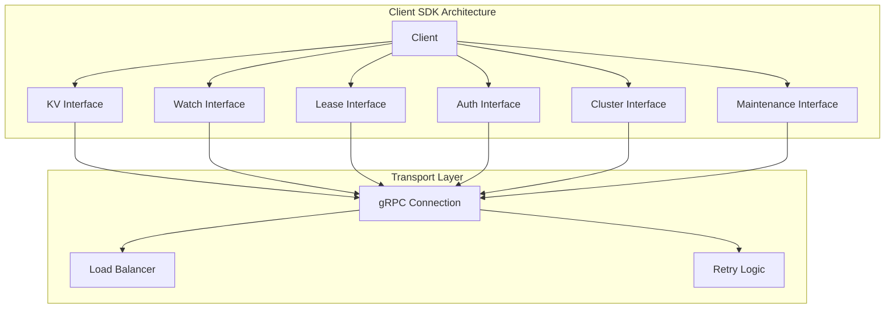
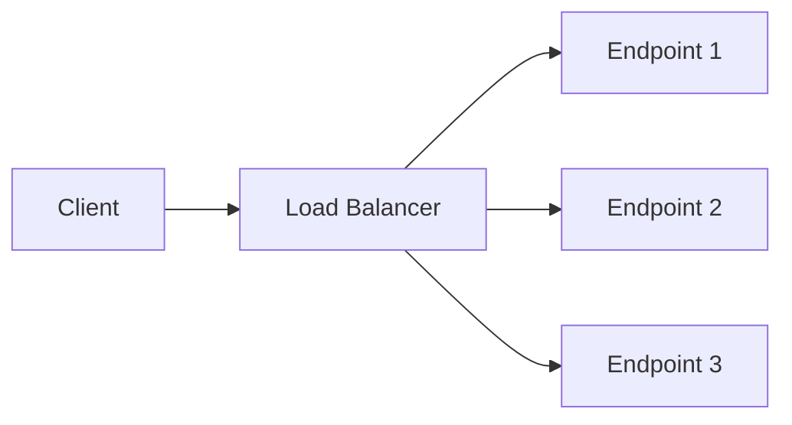

# etcd 客户端 SDK 使用指南

## 概述

etcd 客户端 SDK 提供了与 etcd 服务器交互的完整接口，支持键值操作、监听、租约管理、认证等功能。本文将深入分析客户端 SDK 的架构设计和使用方法。

## 客户端架构



## 核心组件

### 1. 客户端主结构

**位置**: `client/v3/client.go`

<augment_code_snippet path="client/v3/client.go" mode="EXCERPT">
````go
type Client struct {
    Cluster
    KV
    Lease
    Watcher
    Auth
    Maintenance
    
    conn     *grpc.ClientConn
    cfg      Config
    creds    grpccredentials.TransportCredentials
    resolver *resolver.EtcdManualResolver
    
    mu           sync.RWMutex
    ctx          context.Context
    cancel       context.CancelFunc
    
    // 用户名和密码
    Username string
    Password string
    
    authTokenBundle credentials.Bundle
    
    callOpts []grpc.CallOption
}
````
</augment_code_snippet>

### 2. 客户端配置

<augment_code_snippet path="client/v3/config.go" mode="EXCERPT">
````go
type Config struct {
    // 服务器端点
    Endpoints []string `json:"endpoints"`
    
    // 自动同步间隔
    AutoSyncInterval time.Duration `json:"auto-sync-interval"`
    
    // 拨号超时
    DialTimeout time.Duration `json:"dial-timeout"`
    
    // 拨号保活时间
    DialKeepAliveTime time.Duration `json:"dial-keep-alive-time"`
    
    // 拨号保活超时
    DialKeepAliveTimeout time.Duration `json:"dial-keep-alive-timeout"`
    
    // 最大调用发送消息大小
    MaxCallSendMsgSize int
    
    // 最大调用接收消息大小
    MaxCallRecvMsgSize int
    
    // TLS 配置
    TLS *tls.Config
    
    // 用户名
    Username string `json:"username"`
    
    // 密码
    Password string `json:"password"`
    
    // 拒绝旧集群
    RejectOldCluster bool `json:"reject-old-cluster"`
    
    // 拨号选项
    DialOptions []grpc.DialOption
    
    // 日志配置
    LogConfig *zap.Config
    Logger    *zap.Logger
    
    // 上下文
    Context context.Context
    
    // 权限令牌
    PermitWithoutStream bool `json:"permit-without-stream"`
}
````
</augment_code_snippet>

## 主要接口实现

### 1. KV 接口

**键值操作接口**:

<augment_code_snippet path="client/v3/kv.go" mode="EXCERPT">
````go
type KV interface {
    // Put 存储键值对
    Put(ctx context.Context, key, val string, opts ...OpOption) (*PutResponse, error)
    
    // Get 获取键值
    Get(ctx context.Context, key string, opts ...OpOption) (*GetResponse, error)
    
    // Delete 删除键
    Delete(ctx context.Context, key string, opts ...OpOption) (*DeleteResponse, error)
    
    // Compact 压缩历史版本
    Compact(ctx context.Context, rev int64, opts ...CompactOption) (*CompactResponse, error)
    
    // Do 执行操作
    Do(ctx context.Context, op Op) (OpResponse, error)
    
    // Txn 创建事务
    Txn(ctx context.Context) Txn
}
````
</augment_code_snippet>

**使用示例**:

```go
// 创建客户端
cli, err := clientv3.New(clientv3.Config{
    Endpoints:   []string{"localhost:2379"},
    DialTimeout: 5 * time.Second,
})
if err != nil {
    log.Fatal(err)
}
defer cli.Close()

// Put 操作
ctx, cancel := context.WithTimeout(context.Background(), time.Second)
_, err = cli.Put(ctx, "sample_key", "sample_value")
cancel()
if err != nil {
    log.Fatal(err)
}

// Get 操作
ctx, cancel = context.WithTimeout(context.Background(), time.Second)
resp, err := cli.Get(ctx, "sample_key")
cancel()
if err != nil {
    log.Fatal(err)
}
for _, ev := range resp.Kvs {
    fmt.Printf("%s : %s\n", ev.Key, ev.Value)
}
```

### 2. Watch 接口

**监听接口**:

<augment_code_snippet path="client/v3/watch.go" mode="EXCERPT">
````go
type Watcher interface {
    // Watch 监听键的变化
    Watch(ctx context.Context, key string, opts ...OpOption) WatchChan
    
    // RequestProgress 请求进度通知
    RequestProgress(ctx context.Context) error
    
    // Close 关闭监听器
    Close() error
}

type WatchChan <-chan WatchResponse

type WatchResponse struct {
    Header pb.ResponseHeader
    Events []*Event
    
    // CompactRevision 压缩版本
    CompactRevision int64
    
    // Canceled 是否被取消
    Canceled bool
    
    // Created 是否是新创建的监听
    Created bool
    
    // IsProgressNotify 是否是进度通知
    IsProgressNotify bool
}
````
</augment_code_snippet>

**使用示例**:

```go
// 监听单个键
rch := cli.Watch(context.Background(), "foo")
for wresp := range rch {
    for _, ev := range wresp.Events {
        fmt.Printf("%s %q : %q\n", ev.Type, ev.Kv.Key, ev.Kv.Value)
    }
}

// 监听前缀
rch = cli.Watch(context.Background(), "foo", clientv3.WithPrefix())
for wresp := range rch {
    for _, ev := range wresp.Events {
        fmt.Printf("%s %q : %q\n", ev.Type, ev.Kv.Key, ev.Kv.Value)
    }
}

// 监听范围
rch = cli.Watch(context.Background(), "foo1", clientv3.WithRange("foo4"))
for wresp := range rch {
    for _, ev := range wresp.Events {
        fmt.Printf("%s %q : %q\n", ev.Type, ev.Kv.Key, ev.Kv.Value)
    }
}
```

### 3. Lease 接口

**租约管理接口**:

<augment_code_snippet path="client/v3/lease.go" mode="EXCERPT">
````go
type Lease interface {
    // Grant 创建租约
    Grant(ctx context.Context, ttl int64) (*LeaseGrantResponse, error)
    
    // Revoke 撤销租约
    Revoke(ctx context.Context, id LeaseID) (*LeaseRevokeResponse, error)
    
    // TimeToLive 获取租约剩余时间
    TimeToLive(ctx context.Context, id LeaseID, opts ...LeaseOption) (*LeaseTimeToLiveResponse, error)
    
    // Leases 列出所有租约
    Leases(ctx context.Context) (*LeaseLeasesResponse, error)
    
    // KeepAlive 保持租约活跃
    KeepAlive(ctx context.Context, id LeaseID) (<-chan *LeaseKeepAliveResponse, error)
    
    // KeepAliveOnce 单次续约
    KeepAliveOnce(ctx context.Context, id LeaseID) (*LeaseKeepAliveResponse, error)
    
    // Close 关闭租约客户端
    Close() error
}
````
</augment_code_snippet>

**使用示例**:

```go
// 创建租约
resp, err := cli.Grant(context.TODO(), 5)
if err != nil {
    log.Fatal(err)
}

// 使用租约存储键值
_, err = cli.Put(context.TODO(), "foo", "bar", clientv3.WithLease(resp.ID))
if err != nil {
    log.Fatal(err)
}

// 保持租约活跃
ch, kaerr := cli.KeepAlive(context.TODO(), resp.ID)
if kaerr != nil {
    log.Fatal(kaerr)
}

for ka := range ch {
    // 处理续约响应
    fmt.Println("ttl:", ka.TTL)
}
```

### 4. 事务接口

**事务操作**:

<augment_code_snippet path="client/v3/txn.go" mode="EXCERPT">
````go
type Txn interface {
    // If 设置条件
    If(cs ...Cmp) Txn
    
    // Then 设置成功时的操作
    Then(ops ...Op) Txn
    
    // Else 设置失败时的操作
    Else(ops ...Op) Txn
    
    // Commit 提交事务
    Commit() (*TxnResponse, error)
}
````
</augment_code_snippet>

**使用示例**:

```go
// 条件事务
kvc := clientv3.NewKV(cli)

_, err = kvc.Put(context.TODO(), "key", "xyz")
if err != nil {
    log.Fatal(err)
}

ctx, cancel := context.WithTimeout(context.Background(), requestTimeout)
_, err = kvc.Txn(ctx).
    If(clientv3.Compare(clientv3.Value("key"), "=", "xyz")).
    Then(clientv3.OpPut("key", "XYZ")).
    Else(clientv3.OpPut("key", "ABC")).
    Commit()
cancel()
if err != nil {
    log.Fatal(err)
}
```

## 高级特性

### 1. 负载均衡

客户端支持多种负载均衡策略：



### 2. 自动重试

```go
// 重试配置
type retryPolicy struct {
    max     int
    backoff backoffFunc
}

func (rp retryPolicy) retry(ctx context.Context, f retryFunc) error {
    var err error
    for i := 0; i < rp.max; i++ {
        if err = f(ctx); err == nil {
            return nil
        }
        if !isRetryableError(err) {
            return err
        }
        if i < rp.max-1 {
            time.Sleep(rp.backoff(i))
        }
    }
    return err
}
```

### 3. 连接管理

```go
// 健康检查
func (c *Client) healthCheck(ctx context.Context) error {
    for _, ep := range c.Endpoints() {
        if _, err := c.Status(ctx, ep); err == nil {
            return nil
        }
    }
    return ErrNoAvailableEndpoints
}

// 自动同步端点
func (c *Client) autoSync() {
    if c.cfg.AutoSyncInterval <= 0 {
        return
    }
    
    ticker := time.NewTicker(c.cfg.AutoSyncInterval)
    defer ticker.Stop()
    
    for {
        select {
        case <-c.ctx.Done():
            return
        case <-ticker.C:
            ctx, cancel := context.WithTimeout(c.ctx, 5*time.Second)
            if err := c.Sync(ctx); err != nil {
                c.lg.Error("failed to sync endpoints", zap.Error(err))
            }
            cancel()
        }
    }
}
```

## 最佳实践

### 1. 连接管理

```go
// 推荐的客户端配置
config := clientv3.Config{
    Endpoints:            []string{"localhost:2379", "localhost:22379", "localhost:32379"},
    DialTimeout:          5 * time.Second,
    DialKeepAliveTime:    10 * time.Second,
    DialKeepAliveTimeout: 3 * time.Second,
    AutoSyncInterval:     30 * time.Second,
}

cli, err := clientv3.New(config)
if err != nil {
    log.Fatal(err)
}
defer cli.Close()
```

### 2. 错误处理

```go
// 检查特定错误类型
if err != nil {
    switch {
    case errors.Is(err, context.DeadlineExceeded):
        // 处理超时
    case errors.Is(err, rpctypes.ErrEmptyKey):
        // 处理空键错误
    case errors.Is(err, rpctypes.ErrKeyNotFound):
        // 处理键不存在错误
    default:
        // 处理其他错误
    }
}
```

### 3. 资源管理

```go
// 使用上下文控制超时
ctx, cancel := context.WithTimeout(context.Background(), 5*time.Second)
defer cancel()

resp, err := cli.Get(ctx, "key")
if err != nil {
    log.Fatal(err)
}

// 及时关闭监听通道
watchCh := cli.Watch(context.Background(), "key")
defer func() {
    // 取消监听
    if watchCh != nil {
        close(watchCh)
    }
}()
```

### 4. 性能优化

```go
// 批量操作
ops := []clientv3.Op{
    clientv3.OpPut("key1", "value1"),
    clientv3.OpPut("key2", "value2"),
    clientv3.OpPut("key3", "value3"),
}

for _, op := range ops {
    if _, err := cli.Do(context.TODO(), op); err != nil {
        log.Fatal(err)
    }
}

// 使用事务进行批量操作
_, err = cli.Txn(context.TODO()).
    Then(ops...).
    Commit()
if err != nil {
    log.Fatal(err)
}
```

## 监控和调试

### 1. 客户端指标

```go
// 启用 gRPC 指标
import "google.golang.org/grpc/stats"

// 创建带指标的客户端
config := clientv3.Config{
    Endpoints: []string{"localhost:2379"},
    DialOptions: []grpc.DialOption{
        grpc.WithStatsHandler(&statsHandler{}),
    },
}
```

### 2. 日志配置

```go
// 配置日志
logConfig := zap.NewProductionConfig()
logConfig.Level = zap.NewAtomicLevelAt(zap.InfoLevel)

config := clientv3.Config{
    Endpoints: []string{"localhost:2379"},
    LogConfig: &logConfig,
}
```

## 总结

etcd 客户端 SDK 提供了完整的功能集合：

1. **完整的 API 支持** - KV、Watch、Lease、Auth 等
2. **高可用性** - 负载均衡、自动重试、故障转移
3. **易用性** - 简洁的接口设计和丰富的选项
4. **性能优化** - 连接复用、批量操作、异步处理
5. **可观测性** - 完善的日志和指标支持

通过合理使用这些特性，可以构建高效、可靠的分布式应用程序。
