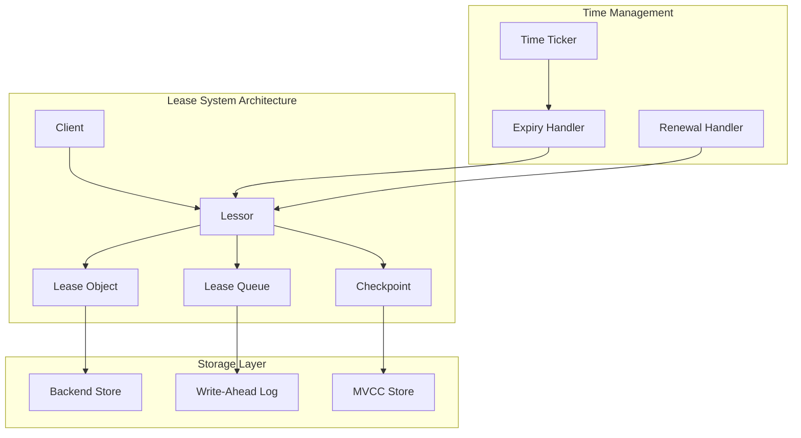
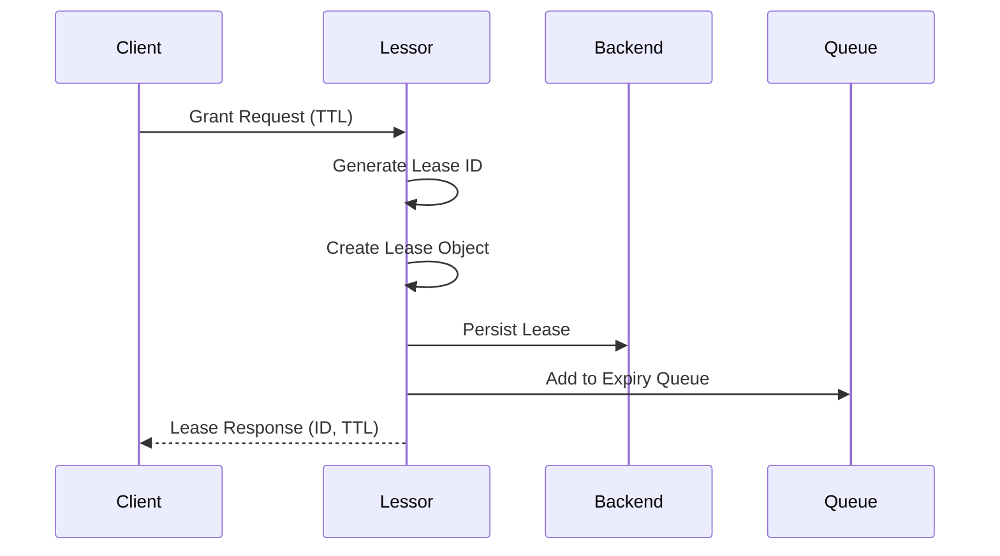
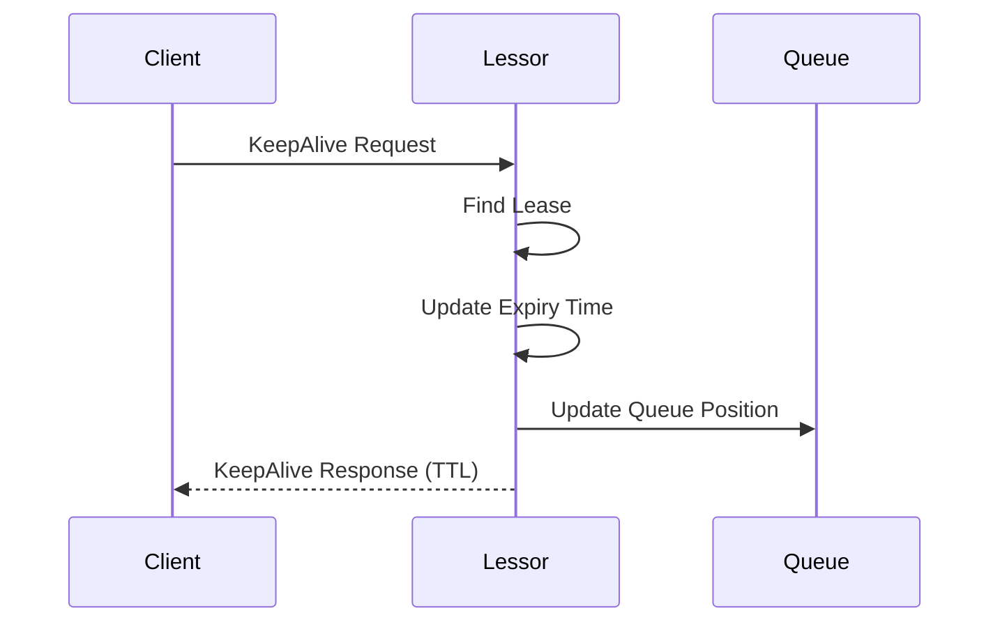

# etcd 租约管理系统

## 概述

etcd 租约（Lease）系统提供了键值对的生命周期管理机制，允许为键设置过期时间，实现自动清理和临时存储功能。本文将深入分析租约系统的设计原理和实现细节。

## 租约架构



## 核心组件

### 1. Lessor 接口

**位置**: `server/lease/lessor.go`

<augment_code_snippet path="server/lease/lessor.go" mode="EXCERPT">
````go
type Lessor interface {
    // SetRangeDeleter 设置范围删除器
    SetRangeDeleter(rd RangeDeleter)
    
    // SetCheckpointer 设置检查点器
    SetCheckpointer(cp Checkpointer)
    
    // Grant 创建租约
    Grant(id LeaseID, ttl int64) (*Lease, error)
    
    // Revoke 撤销租约
    Revoke(id LeaseID) error
    
    // Checkpoint 创建检查点
    Checkpoint(id LeaseID, remainingTTL int64) error
    
    // Attach 将键附加到租约
    Attach(id LeaseID, items []LeaseItem) error
    
    // GetLease 获取租约信息
    GetLease(id LeaseID) *Lease
    
    // Detach 从租约中分离键
    Detach(id LeaseID, items []LeaseItem) error
    
    // Promote 提升租约
    Promote(extend time.Duration)
    
    // Demote 降级租约
    Demote()
    
    // Renew 续约
    Renew(id LeaseID) (int64, error)
    
    // Lookup 查找租约
    Lookup(id LeaseID) *Lease
    
    // Leases 获取所有租约
    Leases() []*Lease
    
    // ExpiredLeasesC 返回过期租约通道
    ExpiredLeasesC() <-chan []*Lease
    
    // Recover 恢复租约
    Recover(b backend.Backend, rd RangeDeleter) error
    
    // Stop 停止租约管理器
    Stop()
}
````
</augment_code_snippet>

### 2. Lease 结构

<augment_code_snippet path="server/lease/lease.go" mode="EXCERPT">
````go
type Lease struct {
    ID           LeaseID
    ttl          int64        // 生存时间（秒）
    remainingTTL int64        // 剩余时间
    expiryTime   time.Time    // 过期时间
    
    // 附加的键值项
    itemSet map[LeaseItem]struct{}
    
    // 撤销时间
    revokec chan struct{}
    
    mu sync.RWMutex
}

type LeaseItem struct {
    Key string
}

type LeaseID int64
````
</augment_code_snippet>

### 3. Lessor 实现

```go
type lessor struct {
    mu sync.RWMutex
    
    // 租约映射
    leaseMap             map[LeaseID]*Lease
    leaseExpiredNotifier *LeaseExpiredNotifier
    leaseCheckpointHeap  LeaseQueue
    
    // 后端存储
    b backend.Backend
    
    // 配置
    minLeaseTTL  int64
    expiredC     chan []*Lease
    stopC        chan struct{}
    doneC        chan struct{}
    
    lg *zap.Logger
    
    // 检查点和删除器
    cp Checkpointer
    rd RangeDeleter
    
    // 时间管理
    primary bool
}
```

## 租约生命周期

### 1. 租约创建



**创建实现**:

```go
func (le *lessor) Grant(id LeaseID, ttl int64) (*Lease, error) {
    if ttl < le.minLeaseTTL || ttl > maxLeaseTTL {
        return nil, ErrLeaseTTLTooLarge
    }
    
    // 生成租约ID
    if id == NoLease {
        id = LeaseID(le.b.Hash())
    }
    
    le.mu.Lock()
    defer le.mu.Unlock()
    
    if _, ok := le.leaseMap[id]; ok {
        return nil, ErrLeaseExists
    }
    
    // 创建租约对象
    l := &Lease{
        ID:           id,
        ttl:          ttl,
        itemSet:      make(map[LeaseItem]struct{}),
        revokec:      make(chan struct{}),
        remainingTTL: ttl,
        expiryTime:   time.Now().Add(time.Duration(ttl) * time.Second),
    }
    
    le.leaseMap[id] = l
    
    // 添加到过期队列
    item := &LeaseWithTime{id: id, time: l.expiryTime.UnixNano()}
    le.leaseExpiredNotifier.RegisterOrUpdate(item)
    
    // 持久化租约
    l.persistTo(le.b)
    
    return l, nil
}
```

### 2. 租约续期



**续期实现**:

```go
func (le *lessor) Renew(id LeaseID) (int64, error) {
    le.mu.Lock()
    defer le.mu.Unlock()
    
    l := le.leaseMap[id]
    if l == nil {
        return -1, ErrLeaseNotFound
    }
    
    // 更新过期时间
    l.expiryTime = time.Now().Add(time.Duration(l.ttl) * time.Second)
    l.remainingTTL = l.ttl
    
    // 更新队列中的位置
    item := &LeaseWithTime{id: id, time: l.expiryTime.UnixNano()}
    le.leaseExpiredNotifier.RegisterOrUpdate(item)
    
    return l.ttl, nil
}
```

### 3. 租约过期处理

```go
func (le *lessor) runLoop() {
    defer close(le.doneC)
    
    for {
        select {
        case <-le.stopC:
            return
        default:
        }
        
        // 检查过期租约
        expired := le.findExpiredLeases(maxLeaseCheckpointBatchSize)
        if len(expired) != 0 {
            select {
            case le.expiredC <- expired:
            default:
                // 如果通道满了，继续处理
            }
        }
        
        time.Sleep(500 * time.Millisecond)
    }
}

func (le *lessor) findExpiredLeases(limit int) []*Lease {
    le.mu.Lock()
    defer le.mu.Unlock()
    
    leases := make([]*Lease, 0, 16)
    
    for i := 0; i < limit; i++ {
        item := le.leaseExpiredNotifier.Poll()
        if item == nil {
            break
        }
        
        lease := le.leaseMap[item.id]
        if lease == nil {
            continue
        }
        
        if time.Now().UnixNano() < item.time {
            // 还未过期，重新加入队列
            le.leaseExpiredNotifier.RegisterOrUpdate(item)
            break
        }
        
        leases = append(leases, lease)
        delete(le.leaseMap, item.id)
        lease.expired = true
    }
    
    return leases
}
```

## 租约队列

### 1. 优先队列实现

<augment_code_snippet path="server/lease/lease_queue.go" mode="EXCERPT">
````go
type LeaseQueue interface {
    RegisterOrUpdate(item *LeaseWithTime)
    Unregister(id LeaseID) *LeaseWithTime
    Poll() *LeaseWithTime
    Len() int
}

type LeaseWithTime struct {
    id   LeaseID
    time int64  // 过期时间（纳秒）
}

type leaseQueue struct {
    array []*LeaseWithTime
    idxMap map[LeaseID]int
}

func (pq *leaseQueue) RegisterOrUpdate(item *LeaseWithTime) {
    if idx, ok := pq.idxMap[item.id]; ok {
        // 更新现有项
        pq.array[idx] = item
        pq.heapifyUp(idx)
        pq.heapifyDown(idx)
    } else {
        // 添加新项
        pq.array = append(pq.array, item)
        newIdx := len(pq.array) - 1
        pq.idxMap[item.id] = newIdx
        pq.heapifyUp(newIdx)
    }
}

func (pq *leaseQueue) Poll() *LeaseWithTime {
    if len(pq.array) == 0 {
        return nil
    }
    
    item := pq.array[0]
    lastIdx := len(pq.array) - 1
    
    pq.array[0] = pq.array[lastIdx]
    pq.array = pq.array[:lastIdx]
    
    delete(pq.idxMap, item.id)
    
    if len(pq.array) > 0 {
        pq.idxMap[pq.array[0].id] = 0
        pq.heapifyDown(0)
    }
    
    return item
}
````
</augment_code_snippet>

### 2. 堆操作

```go
func (pq *leaseQueue) heapifyUp(idx int) {
    for idx > 0 {
        parentIdx := (idx - 1) / 2
        if pq.array[idx].time >= pq.array[parentIdx].time {
            break
        }
        
        pq.swap(idx, parentIdx)
        idx = parentIdx
    }
}

func (pq *leaseQueue) heapifyDown(idx int) {
    for {
        leftChild := 2*idx + 1
        rightChild := 2*idx + 2
        smallest := idx
        
        if leftChild < len(pq.array) && pq.array[leftChild].time < pq.array[smallest].time {
            smallest = leftChild
        }
        
        if rightChild < len(pq.array) && pq.array[rightChild].time < pq.array[smallest].time {
            smallest = rightChild
        }
        
        if smallest == idx {
            break
        }
        
        pq.swap(idx, smallest)
        idx = smallest
    }
}

func (pq *leaseQueue) swap(i, j int) {
    pq.array[i], pq.array[j] = pq.array[j], pq.array[i]
    pq.idxMap[pq.array[i].id] = i
    pq.idxMap[pq.array[j].id] = j
}
```

## 检查点机制

### 1. 检查点创建

```go
func (le *lessor) Checkpoint(id LeaseID, remainingTTL int64) error {
    le.mu.Lock()
    defer le.mu.Unlock()
    
    l := le.leaseMap[id]
    if l == nil {
        return ErrLeaseNotFound
    }
    
    if remainingTTL <= 0 {
        return ErrLeaseInvalidTTL
    }
    
    // 更新剩余TTL
    l.remainingTTL = remainingTTL
    l.expiryTime = time.Now().Add(time.Duration(remainingTTL) * time.Second)
    
    // 持久化检查点
    if le.cp != nil {
        le.cp.Checkpoint(id, remainingTTL)
    }
    
    return nil
}
```

### 2. 检查点恢复

```go
func (le *lessor) Recover(b backend.Backend, rd RangeDeleter) error {
    le.mu.Lock()
    defer le.mu.Unlock()
    
    le.b = b
    le.rd = rd
    
    tx := b.ReadTx()
    tx.RLock()
    defer tx.RUnlock()
    
    // 恢复租约
    _, vs := tx.UnsafeRange(leaseBucketName, nil, nil, 0)
    for _, v := range vs {
        var lpb leasepb.Lease
        if err := lpb.Unmarshal(v); err != nil {
            continue
        }
        
        ID := LeaseID(lpb.ID)
        if lpb.TTL < le.minLeaseTTL {
            continue
        }
        
        le.leaseMap[ID] = &Lease{
            ID:           ID,
            ttl:          lpb.TTL,
            remainingTTL: lpb.TTL,
            itemSet:      make(map[LeaseItem]struct{}),
            revokec:      make(chan struct{}),
        }
    }
    
    // 恢复租约检查点
    _, vs = tx.UnsafeRange(leaseCheckpointBucketName, nil, nil, 0)
    for _, v := range vs {
        var cpb leasepb.LeaseCheckpoint
        if err := cpb.Unmarshal(v); err != nil {
            continue
        }
        
        ID := LeaseID(cpb.ID)
        if l := le.leaseMap[ID]; l != nil {
            l.remainingTTL = cpb.RemainingTTL
        }
    }
    
    le.initAndRecover()
    
    return nil
}
```

## 键值关联

### 1. 附加键到租约

```go
func (le *lessor) Attach(id LeaseID, items []LeaseItem) error {
    le.mu.Lock()
    defer le.mu.Unlock()
    
    l := le.leaseMap[id]
    if l == nil {
        return ErrLeaseNotFound
    }
    
    l.mu.Lock()
    for _, item := range items {
        l.itemSet[item] = struct{}{}
    }
    l.mu.Unlock()
    
    return nil
}
```

### 2. 从租约分离键

```go
func (le *lessor) Detach(id LeaseID, items []LeaseItem) error {
    le.mu.Lock()
    defer le.mu.Unlock()
    
    l := le.leaseMap[id]
    if l == nil {
        return ErrLeaseNotFound
    }
    
    l.mu.Lock()
    for _, item := range items {
        delete(l.itemSet, item)
    }
    l.mu.Unlock()
    
    return nil
}
```

### 3. 租约撤销时的键清理

```go
func (le *lessor) Revoke(id LeaseID) error {
    le.mu.Lock()
    defer le.mu.Unlock()
    
    l := le.leaseMap[id]
    if l == nil {
        return ErrLeaseNotFound
    }
    
    // 删除关联的键
    if le.rd != nil {
        var keys []string
        l.mu.RLock()
        for item := range l.itemSet {
            keys = append(keys, item.Key)
        }
        l.mu.RUnlock()
        
        for _, key := range keys {
            if _, err := le.rd.TxnDeleteRange([]byte(key), nil); err != nil {
                return err
            }
        }
    }
    
    // 从映射中删除租约
    delete(le.leaseMap, id)
    
    // 从队列中移除
    le.leaseExpiredNotifier.Unregister(id)
    
    // 从后端存储删除
    le.b.BatchTx().UnsafeDelete(leaseBucketName, int64ToBytes(int64(id)))
    
    return nil
}
```

## 性能优化

### 1. 批量处理

```go
const (
    maxLeaseCheckpointBatchSize = 1000
    leaseCheckpointInterval     = 5 * time.Second
)

func (le *lessor) checkpointScheduledLeases() {
    var cps []LeaseCheckpoint
    
    // 批量收集需要检查点的租约
    le.mu.RLock()
    for id, l := range le.leaseMap {
        if l.needsCheckpoint() {
            cps = append(cps, LeaseCheckpoint{
                ID:           id,
                RemainingTTL: l.remainingTTL,
            })
            
            if len(cps) >= maxLeaseCheckpointBatchSize {
                break
            }
        }
    }
    le.mu.RUnlock()
    
    // 批量创建检查点
    if len(cps) > 0 && le.cp != nil {
        le.cp.CheckpointBatch(cps)
    }
}
```

### 2. 内存优化

```go
// 使用对象池减少内存分配
var leasePool = sync.Pool{
    New: func() interface{} {
        return &Lease{
            itemSet: make(map[LeaseItem]struct{}),
            revokec: make(chan struct{}),
        }
    },
}

func newLease(id LeaseID, ttl int64) *Lease {
    l := leasePool.Get().(*Lease)
    l.ID = id
    l.ttl = ttl
    l.remainingTTL = ttl
    l.expiryTime = time.Now().Add(time.Duration(ttl) * time.Second)
    return l
}

func (l *Lease) recycle() {
    l.ID = NoLease
    l.ttl = 0
    l.remainingTTL = 0
    for k := range l.itemSet {
        delete(l.itemSet, k)
    }
    leasePool.Put(l)
}
```

## 监控指标

```go
var (
    leaseGranted = prometheus.NewCounterVec(
        prometheus.CounterOpts{
            Namespace: "etcd",
            Subsystem: "server",
            Name:      "lease_granted_total",
        },
        []string{"type"},
    )
    
    leaseRevoked = prometheus.NewCounterVec(
        prometheus.CounterOpts{
            Namespace: "etcd",
            Subsystem: "server",
            Name:      "lease_revoked_total",
        },
        []string{"type"},
    )
    
    leaseRenewed = prometheus.NewCounter(
        prometheus.CounterOpts{
            Namespace: "etcd",
            Subsystem: "server",
            Name:      "lease_renewed_total",
        },
    )
    
    leaseExpired = prometheus.NewCounter(
        prometheus.CounterOpts{
            Namespace: "etcd",
            Subsystem: "server",
            Name:      "lease_expired_total",
        },
    )
)
```

## 使用场景

### 1. 服务发现

```go
// 服务注册
func registerService(cli *clientv3.Client, serviceName, serviceAddr string, ttl int64) error {
    // 创建租约
    resp, err := cli.Grant(context.Background(), ttl)
    if err != nil {
        return err
    }
    
    // 注册服务
    key := fmt.Sprintf("/services/%s/%s", serviceName, serviceAddr)
    _, err = cli.Put(context.Background(), key, serviceAddr, clientv3.WithLease(resp.ID))
    if err != nil {
        return err
    }
    
    // 保持租约活跃
    ch, kaerr := cli.KeepAlive(context.Background(), resp.ID)
    if kaerr != nil {
        return kaerr
    }
    
    go func() {
        for ka := range ch {
            // 处理续约响应
            log.Printf("Service %s renewed, TTL: %d", serviceName, ka.TTL)
        }
    }()
    
    return nil
}
```

### 2. 分布式锁

```go
// 获取分布式锁
func acquireLock(cli *clientv3.Client, lockKey string, ttl int64) (*clientv3.LeaseID, error) {
    // 创建租约
    resp, err := cli.Grant(context.Background(), ttl)
    if err != nil {
        return nil, err
    }
    
    // 尝试获取锁
    txn := cli.Txn(context.Background())
    txn = txn.If(clientv3.Compare(clientv3.CreateRevision(lockKey), "=", 0))
    txn = txn.Then(clientv3.OpPut(lockKey, "locked", clientv3.WithLease(resp.ID)))
    txn = txn.Else(clientv3.OpGet(lockKey))
    
    txnResp, err := txn.Commit()
    if err != nil {
        cli.Revoke(context.Background(), resp.ID)
        return nil, err
    }
    
    if !txnResp.Succeeded {
        cli.Revoke(context.Background(), resp.ID)
        return nil, fmt.Errorf("lock already held")
    }
    
    return &resp.ID, nil
}
```

## 总结

etcd 租约管理系统具有以下特点：

1. **高效的时间管理** - 使用优先队列管理租约过期
2. **可靠的持久化** - 支持检查点和恢复机制
3. **灵活的关联** - 支持键值对与租约的动态关联
4. **性能优化** - 批量处理和内存优化
5. **丰富的应用场景** - 支持服务发现、分布式锁等

这些特性使得租约系统成为构建分布式应用的重要基础设施。
