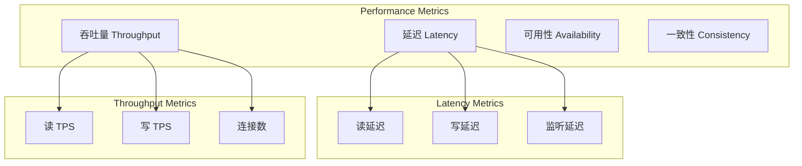
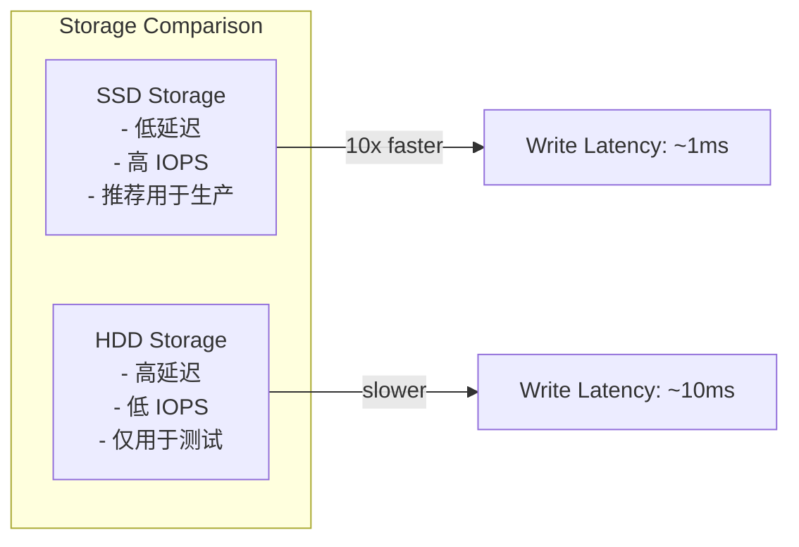
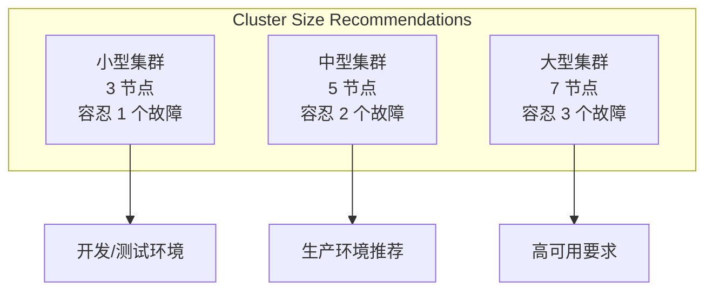

# etcd 性能优化指南

## 概述

etcd 作为分布式键值存储系统，其性能直接影响整个分布式系统的表现。本文将从硬件配置、软件调优、架构设计等多个维度分析 etcd 的性能优化策略。

## 性能指标

### 1. 关键性能指标



### 2. 性能基准

**典型性能数据**:
- **写入延迟**: < 10ms (P99)
- **读取延迟**: < 1ms (P99)
- **写入吞吐量**: 10,000+ ops/sec
- **读取吞吐量**: 100,000+ ops/sec

## 硬件优化

### 1. 存储配置

**SSD vs HDD**:


**存储分离**:
```bash
# WAL 和数据分离
etcd --name=node1 \
  --data-dir=/ssd1/etcd \
  --wal-dir=/ssd2/etcd-wal \
  --listen-client-urls=http://0.0.0.0:2379
```

### 2. 内存配置

**内存需求计算**:
```
总内存需求 = 基础内存 + 数据内存 + 缓存内存
- 基础内存: ~100MB
- 数据内存: 键值对数量 × 平均大小 × 2
- 缓存内存: 后端数据库大小 × 0.5
```

**内存优化配置**:
```yaml
# etcd 配置
quota-backend-bytes: 2147483648  # 2GB
auto-compaction-retention: "1h"
auto-compaction-mode: "periodic"
```

### 3. 网络配置

**网络延迟要求**:
- **集群内通信**: < 1ms RTT
- **客户端通信**: < 10ms RTT
- **带宽**: 至少 100Mbps

**网络优化**:
```bash
# 调整 TCP 参数
echo 'net.core.rmem_max = 134217728' >> /etc/sysctl.conf
echo 'net.core.wmem_max = 134217728' >> /etc/sysctl.conf
echo 'net.ipv4.tcp_rmem = 4096 87380 134217728' >> /etc/sysctl.conf
echo 'net.ipv4.tcp_wmem = 4096 65536 134217728' >> /etc/sysctl.conf
sysctl -p
```

## 软件配置优化

### 1. etcd 服务器配置

**核心参数调优**:
```yaml
# 心跳和选举
heartbeat-interval: 100          # 心跳间隔 (ms)
election-timeout: 1000           # 选举超时 (ms)

# 快照配置
snapshot-count: 10000            # 快照触发条目数
max-snapshots: 5                 # 保留快照数量
max-wals: 5                      # 保留 WAL 文件数量

# 压缩配置
auto-compaction-mode: periodic   # 自动压缩模式
auto-compaction-retention: "1h"  # 压缩保留时间

# 后端配置
quota-backend-bytes: 2147483648  # 后端存储配额
backend-batch-limit: 10000       # 批处理限制
backend-batch-interval: 100ms    # 批处理间隔

# 客户端配置
max-request-bytes: 1572864       # 最大请求大小
grpc-keepalive-min-time: 5s      # gRPC 保活最小时间
grpc-keepalive-interval: 2h      # gRPC 保活间隔
grpc-keepalive-timeout: 20s      # gRPC 保活超时
```

### 2. 操作系统优化

**文件系统配置**:
```bash
# 使用 ext4 或 xfs
mkfs.ext4 -F /dev/sdb1
mount -o noatime,data=writeback /dev/sdb1 /var/lib/etcd

# 或者使用 xfs
mkfs.xfs -f /dev/sdb1
mount -o noatime,largeio,inode64,swalloc /dev/sdb1 /var/lib/etcd
```

**内核参数调优**:
```bash
# 文件描述符限制
echo '* soft nofile 65536' >> /etc/security/limits.conf
echo '* hard nofile 65536' >> /etc/security/limits.conf

# 虚拟内存设置
echo 'vm.swappiness = 1' >> /etc/sysctl.conf
echo 'vm.dirty_ratio = 15' >> /etc/sysctl.conf
echo 'vm.dirty_background_ratio = 5' >> /etc/sysctl.conf

# I/O 调度器
echo 'deadline' > /sys/block/sdb/queue/scheduler
```

## 应用层优化

### 1. 客户端优化

**连接池配置**:
```go
config := clientv3.Config{
    Endpoints:            []string{"localhost:2379"},
    DialTimeout:          5 * time.Second,
    DialKeepAliveTime:    10 * time.Second,
    DialKeepAliveTimeout: 3 * time.Second,
    MaxCallSendMsgSize:   2 * 1024 * 1024,  // 2MB
    MaxCallRecvMsgSize:   4 * 1024 * 1024,  // 4MB,
}

cli, err := clientv3.New(config)
```

**批量操作**:
```go
// 使用事务进行批量操作
ops := []clientv3.Op{
    clientv3.OpPut("key1", "value1"),
    clientv3.OpPut("key2", "value2"),
    clientv3.OpPut("key3", "value3"),
}

_, err := cli.Txn(context.Background()).Then(ops...).Commit()
```

**异步处理**:
```go
// 异步监听
watchCh := cli.Watch(context.Background(), "prefix", clientv3.WithPrefix())
go func() {
    for wresp := range watchCh {
        for _, ev := range wresp.Events {
            // 异步处理事件
            go processEvent(ev)
        }
    }
}()
```

### 2. 数据模型优化

**键设计原则**:
```
好的设计:
/services/web/instance-1
/services/web/instance-2
/config/database/host
/config/database/port

避免的设计:
/very/deep/nested/key/structure/that/is/too/long
/keys-with-random-suffixes-12345
```

**值大小控制**:
```go
// 推荐值大小 < 1MB
const MaxValueSize = 1024 * 1024  // 1MB

func putLargeValue(cli *clientv3.Client, key string, data []byte) error {
    if len(data) > MaxValueSize {
        // 分块存储
        return putChunkedValue(cli, key, data)
    }
    
    _, err := cli.Put(context.Background(), key, string(data))
    return err
}
```

## 集群架构优化

### 1. 集群规模

**节点数量选择**:


### 2. 部署拓扑

**跨可用区部署**:
```yaml
# 节点分布
node1: us-east-1a
node2: us-east-1b  
node3: us-east-1c
node4: us-west-1a
node5: us-west-1b
```

**网络分离**:
```bash
# 客户端网络
listen-client-urls: http://10.0.1.10:2379

# 集群内网络  
listen-peer-urls: http://192.168.1.10:2380
```

## 监控和调优

### 1. 关键指标监控

**延迟指标**:
```go
var (
    proposalDurations = prometheus.NewHistogramVec(
        prometheus.HistogramOpts{
            Namespace: "etcd",
            Subsystem: "server",
            Name:      "proposal_duration_seconds",
            Buckets:   prometheus.DefBuckets,
        },
        []string{"type"},
    )
    
    diskWALFsyncDurations = prometheus.NewHistogram(
        prometheus.HistogramOpts{
            Namespace: "etcd",
            Subsystem: "disk",
            Name:      "wal_fsync_duration_seconds",
            Buckets:   prometheus.DefBuckets,
        },
    )
)
```

**吞吐量指标**:
```go
var (
    appliedTotal = prometheus.NewCounterVec(
        prometheus.CounterOpts{
            Namespace: "etcd",
            Subsystem: "server",
            Name:      "proposals_applied_total",
        },
        []string{"type"},
    )
    
    clientRequests = prometheus.NewCounterVec(
        prometheus.CounterOpts{
            Namespace: "etcd",
            Subsystem: "server",
            Name:      "client_requests_total",
        },
        []string{"type", "client_api_version"},
    )
)
```

### 2. 性能分析工具

**pprof 分析**:
```bash
# CPU 分析
go tool pprof http://localhost:2379/debug/pprof/profile?seconds=30

# 内存分析
go tool pprof http://localhost:2379/debug/pprof/heap

# 阻塞分析
go tool pprof http://localhost:2379/debug/pprof/block
```

**trace 分析**:
```bash
# 获取 trace
curl http://localhost:2379/debug/pprof/trace?seconds=5 > trace.out

# 分析 trace
go tool trace trace.out
```

## 故障排除

### 1. 性能问题诊断

**慢查询分析**:
```bash
# 启用慢查询日志
etcd --log-level=debug --logger=zap

# 分析日志
grep "slow request" /var/log/etcd.log
```

**磁盘性能测试**:
```bash
# 测试磁盘延迟
fio --name=etcd-test --ioengine=libaio --direct=1 --bs=4k --iodepth=1 \
    --rw=write --size=1G --runtime=60 --time_based --filename=/var/lib/etcd/test

# 测试磁盘吞吐量
fio --name=etcd-test --ioengine=libaio --direct=1 --bs=1M --iodepth=32 \
    --rw=write --size=1G --runtime=60 --time_based --filename=/var/lib/etcd/test
```

### 2. 内存问题排查

**内存使用分析**:
```bash
# 查看内存使用
ps aux | grep etcd
cat /proc/$(pgrep etcd)/status | grep VmRSS

# 分析内存分配
go tool pprof http://localhost:2379/debug/pprof/heap
```

## 最佳实践总结

### 1. 硬件配置

- **存储**: 使用 SSD，WAL 和数据分离
- **内存**: 至少 8GB，推荐 16GB+
- **网络**: 低延迟网络，避免跨地域部署
- **CPU**: 多核 CPU，避免 CPU 密集型任务

### 2. 软件配置

- **压缩**: 启用自动压缩，定期清理历史版本
- **快照**: 合理设置快照频率
- **批处理**: 启用批处理优化写入性能
- **监控**: 完善的监控和告警机制

### 3. 应用设计

- **键设计**: 合理的键命名和层次结构
- **值大小**: 控制值的大小，避免大对象
- **批量操作**: 使用事务进行批量操作
- **连接复用**: 合理使用连接池

### 4. 运维管理

- **定期备份**: 自动化备份策略
- **版本升级**: 滚动升级，避免服务中断
- **容量规划**: 提前规划存储和性能需求
- **故障演练**: 定期进行故障恢复演练

通过以上优化策略，可以显著提升 etcd 的性能表现，满足生产环境的高性能要求。
