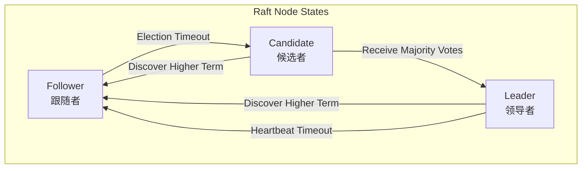
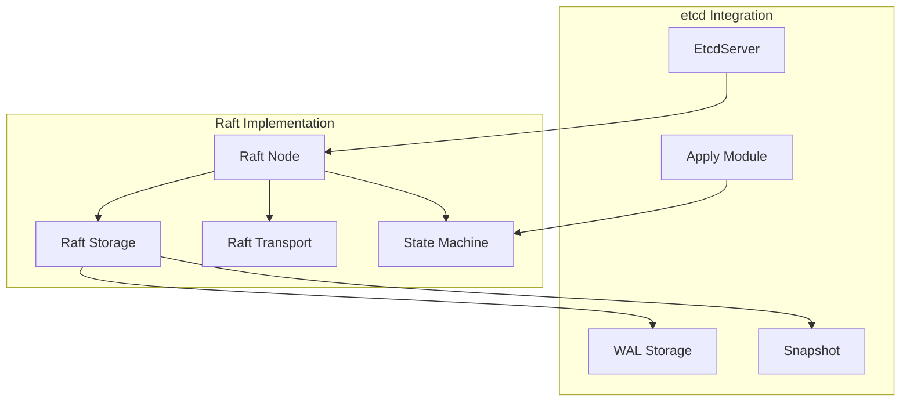
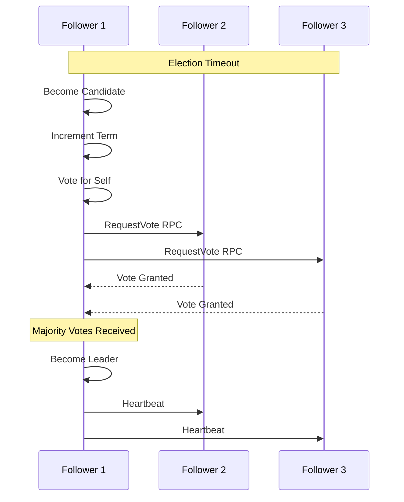
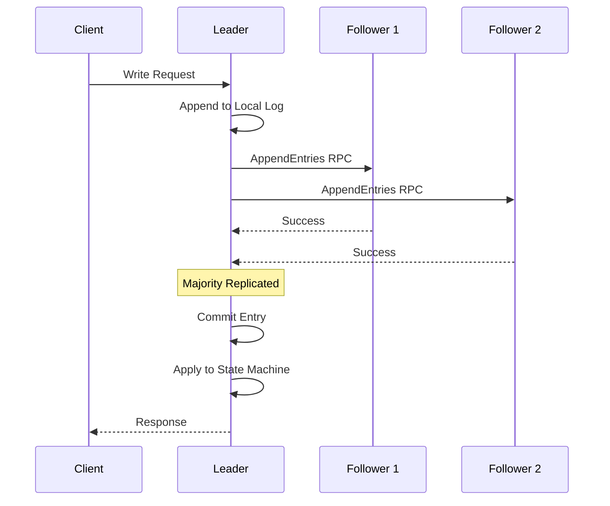
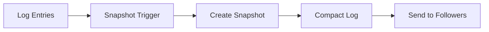
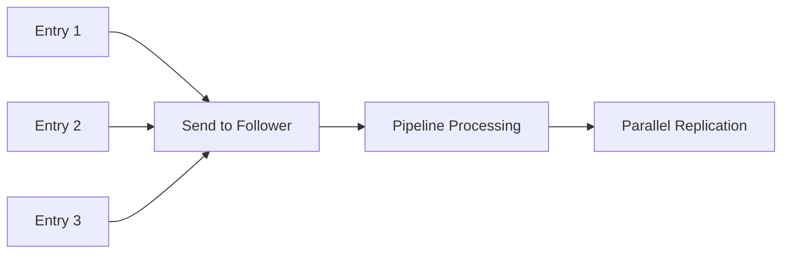
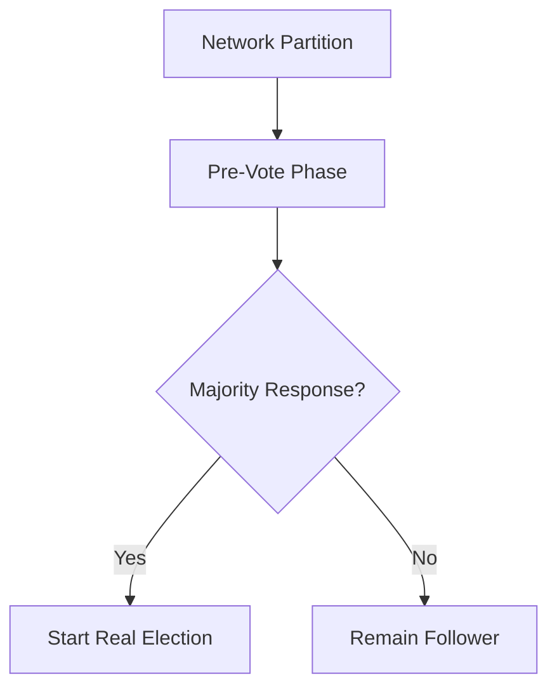
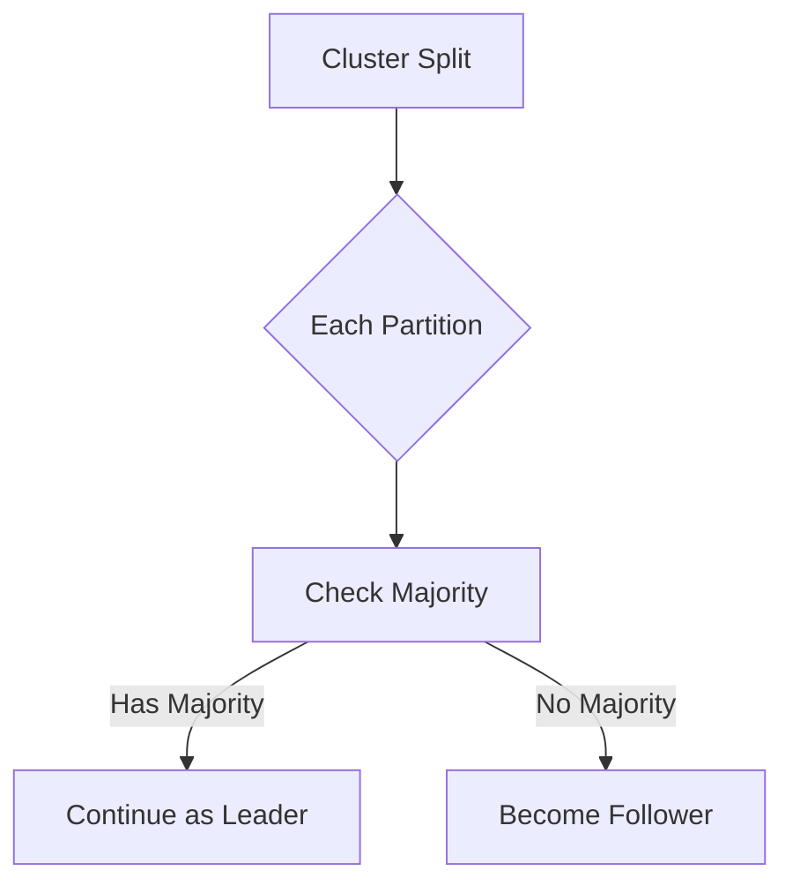
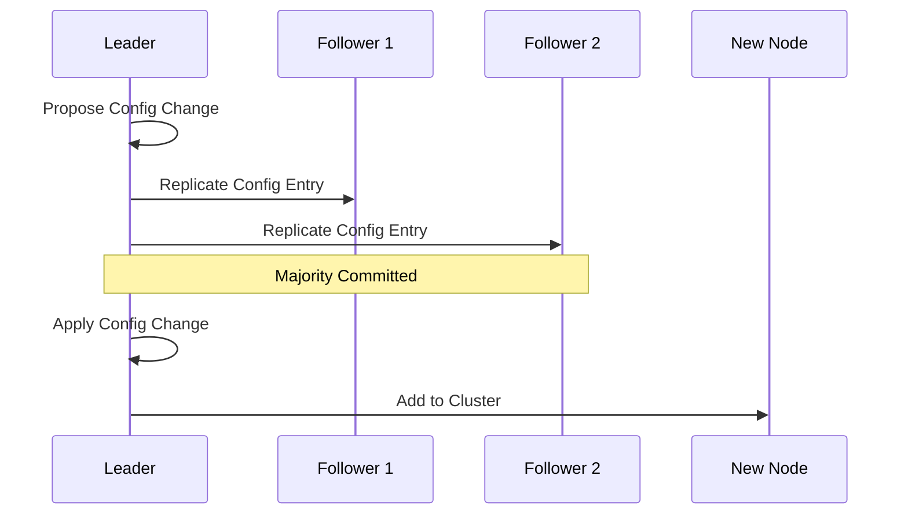

# etcd Raft 一致性算法实现

## 概述

Raft 是 etcd 实现分布式一致性的核心算法。本文将深入分析 etcd 中 Raft 算法的实现原理、关键组件和优化策略。

## Raft 算法基础

### 核心概念



### 关键特性

1. **领导者选举** - 确保集群中只有一个领导者
2. **日志复制** - 保证所有节点的日志一致
3. **安全性** - 防止数据丢失和不一致

## etcd Raft 实现架构



## 核心组件实现

### 1. Raft Node 结构

**位置**: `server/etcdserver/raft.go`

<augment_code_snippet path="server/etcdserver/raft.go" mode="EXCERPT">
````go
type raftNode struct {
    lg *zap.Logger
    
    // Raft 核心
    node        raft.Node
    raftStorage *raft.MemoryStorage
    storage     Storage
    
    // 传输层
    transport rafthttp.Transporter
    
    // 状态管理
    lead          uint64
    islead        bool
    
    // 通道
    proposeC    <-chan string
    confChangeC <-chan raftpb.ConfChange
    commitC     chan<- *commit
    errorC      chan<- error
}
````
</augment_code_snippet>

### 2. 领导者选举流程



### 3. 日志复制机制



## 关键实现细节

### 1. 日志条目结构

<augment_code_snippet path="api/etcdserverpb/raft_internal.proto" mode="EXCERPT">
````proto
message InternalRaftRequest {
  RequestHeader header = 100;
  uint64 ID = 1;

  RangeRequest range = 3;
  PutRequest put = 4;
  DeleteRangeRequest delete_range = 5;
  TxnRequest txn = 6;
  CompactionRequest compaction = 7;

  LeaseGrantRequest lease_grant = 8;
  LeaseRevokeRequest lease_revoke = 9;
}
````
</augment_code_snippet>

### 2. 状态机应用

<augment_code_snippet path="server/etcdserver/apply" mode="EXCERPT">
````go
func (s *EtcdServer) applyEntryNormal(e *raftpb.Entry) {
    shouldApplyV3 := false
    
    if e.Index > s.consistIndex.ConsistentIndex() {
        // 防止重复应用
        shouldApplyV3 = true
    }
    
    defer s.setAppliedIndex(e.Index)
    defer s.setTerm(e.Term)
    
    // 解析请求
    var raftReq pb.InternalRaftRequest
    if !pbutil.MaybeUnmarshal(&raftReq, e.Data) {
        plog.Panicf("failed to unmarshal raftpb entry")
    }
    
    if shouldApplyV3 {
        s.applyV3.Apply(&raftReq)
    }
}
````
</augment_code_snippet>

### 3. 快照机制

快照用于压缩日志和快速同步落后的节点：



### 4. 网络传输层

**位置**: `server/etcdserver/api/rafthttp/`

传输层负责节点间的消息传递：

- **Stream** - 用于频繁的小消息（心跳、日志条目）
- **Pipeline** - 用于批量消息传输
- **Snapshot** - 用于大型快照传输

## 性能优化策略

### 1. 批量处理

- 批量提交日志条目
- 批量发送网络消息
- 批量应用状态变更

### 2. 流水线复制



### 3. 预投票机制

防止网络分区恢复时的无效选举：



## 故障处理

### 1. 网络分区处理

- **Quorum 检查** - 确保领导者能联系到大多数节点
- **自动降级** - 失去大多数支持时自动变为跟随者

### 2. 节点故障恢复

- **日志修复** - 通过 WAL 恢复未提交的日志
- **快照恢复** - 从快照快速恢复状态
- **增量同步** - 只同步缺失的日志条目

### 3. 脑裂预防



## 配置变更

### 1. 单步配置变更

etcd 使用单步配置变更确保安全性：



### 2. 学习者节点

支持学习者节点进行安全的集群扩展：

- 学习者只接收日志，不参与投票
- 学习者追上进度后可提升为投票成员

## 监控和调试

### 1. Raft 状态指标

- **Term** - 当前任期
- **Leader** - 当前领导者
- **Log Index** - 日志索引
- **Commit Index** - 提交索引

### 2. 性能指标

- **Proposal Duration** - 提议处理时间
- **Apply Duration** - 应用处理时间
- **Network Latency** - 网络延迟

### 3. 健康检查

```go
func (s *EtcdServer) raftStatus() raft.Status {
    return s.r.node.Status()
}
```

## 最佳实践

### 1. 集群规模

- **推荐奇数节点** - 3、5、7 个节点
- **容错能力** - N 个节点可容忍 (N-1)/2 个故障

### 2. 网络要求

- **低延迟** - 心跳间隔通常 100ms
- **稳定连接** - 避免频繁的网络抖动

### 3. 存储配置

- **SSD 存储** - 提供更好的 I/O 性能
- **独立磁盘** - WAL 和数据分离存储

## 总结

etcd 的 Raft 实现具有以下特点：

1. **完整性** - 实现了 Raft 算法的所有核心功能
2. **高性能** - 通过批量处理和流水线优化性能
3. **可靠性** - 完善的故障检测和恢复机制
4. **安全性** - 严格的一致性保证和脑裂预防
5. **可扩展性** - 支持动态配置变更和学习者节点

这些特性使得 etcd 能够在复杂的分布式环境中提供强一致性保证，为分布式系统提供可靠的协调服务基础。
