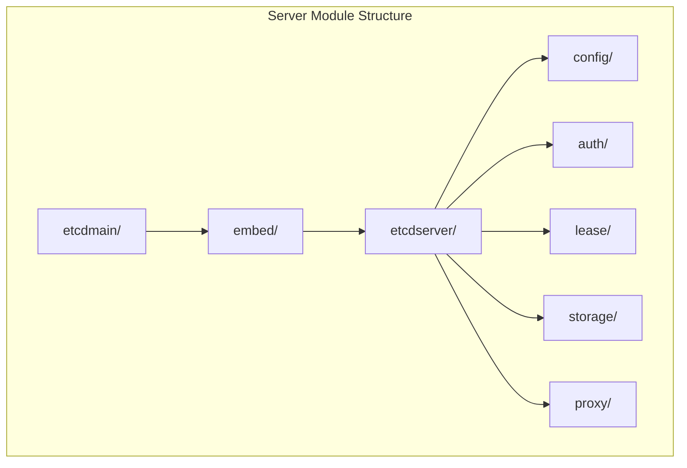
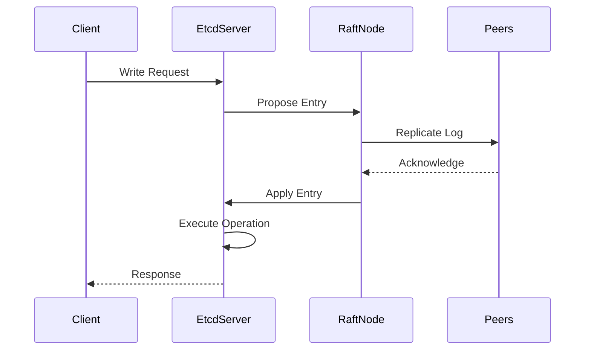
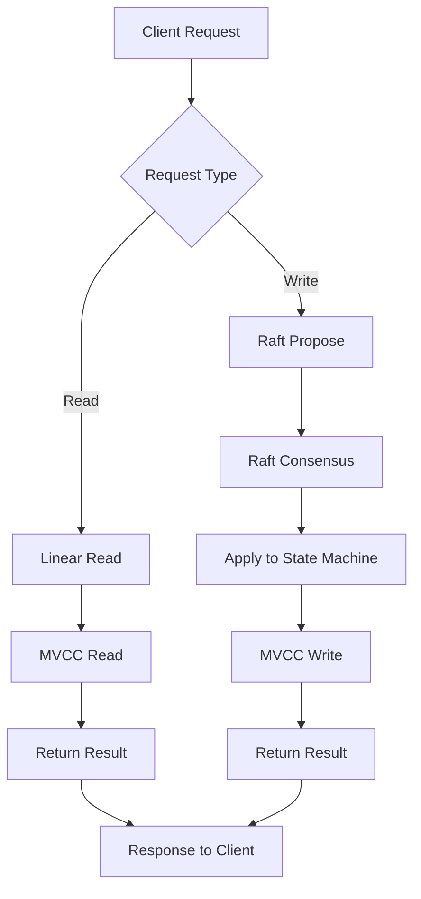
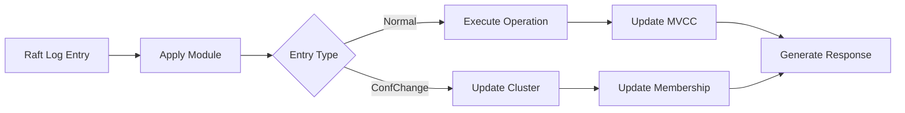
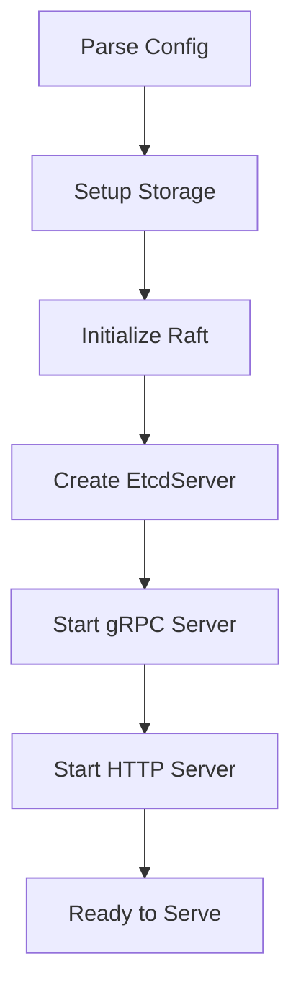

# etcd Server 模块深度分析

## 概述

etcd Server 模块是整个 etcd 系统的核心，负责处理客户端请求、管理集群状态、协调 Raft 一致性算法。本文将深入分析 Server 模块的架构设计和实现原理。

## 模块结构



## 核心组件分析

### 1. EtcdServer 核心结构

**位置**: `server/etcdserver/server.go`

```go
type EtcdServer struct {
    // Raft 相关
    r            raftNode
    raftStorage  *raft.MemoryStorage
    
    // 存储相关
    kv           mvcc.ConsistentWatchableKV
    lessor       lease.Lessor
    bemu         sync.RWMutex
    be           backend.Backend
    
    // 集群管理
    cluster      *membership.RaftCluster
    
    // 配置和状态
    cfg          config.ServerConfig
    readych      chan struct{}
    
    // 认证
    authStore    auth.AuthStore
}
```

**主要职责**:
- 协调 Raft 一致性算法
- 管理 MVCC 存储引擎
- 处理客户端请求
- 维护集群成员关系

### 2. Raft 集成



**Raft 节点实现**:

```go
type raftNode struct {
    node        raft.Node
    storage     *raft.MemoryStorage
    wal         *wal.WAL
    snapshotter *snap.Snapshotter
    
    // 通道
    proposeC    <-chan string
    confChangeC <-chan raftpb.ConfChange
    commitC     chan<- *commit
    errorC      chan<- error
}
```

### 3. 请求处理流程



**请求处理代码示例**:

```go
func (s *EtcdServer) Put(ctx context.Context, r *pb.PutRequest) (*pb.PutResponse, error) {
    // 构造内部请求
    req := &pb.InternalRaftRequest{
        Put: r,
        Header: &pb.RequestHeader{
            ID: s.reqIDGen.Next(),
        },
    }
    
    // 通过 Raft 提议
    result, err := s.processInternalRaftRequestOnce(ctx, req)
    if err != nil {
        return nil, err
    }
    
    return result.(*pb.PutResponse), nil
}
```

### 4. 应用状态机 (Apply)

**位置**: `server/etcdserver/apply/`



**Apply 处理逻辑**:

```go
func (a *applierV3backend) Apply(r *pb.InternalRaftRequest) *applyResult {
    switch {
    case r.Range != nil:
        return a.Range(r.Range)
    case r.Put != nil:
        return a.Put(r.Put)
    case r.DeleteRange != nil:
        return a.DeleteRange(r.DeleteRange)
    case r.Txn != nil:
        return a.Txn(r.Txn)
    case r.Compaction != nil:
        return a.Compaction(r.Compaction)
    case r.LeaseGrant != nil:
        return a.LeaseGrant(r.LeaseGrant)
    case r.LeaseRevoke != nil:
        return a.LeaseRevoke(r.LeaseRevoke)
    default:
        panic("not implemented")
    }
}
```

### 5. 集群管理

**位置**: `server/etcdserver/api/membership/`

```go
type RaftCluster struct {
    localID    types.ID
    cid        types.ID
    token      string
    members    map[types.ID]*Member
    removed    map[types.ID]bool
    
    store      v2store.Store
    
    sync.Mutex
}
```

**集群操作**:
- 成员添加/删除
- 领导者选举
- 配置变更
- 健康检查

### 6. 嵌入式服务器 (Embed)

**位置**: `server/embed/etcd.go`

```go
type Etcd struct {
    Peers   []*peerListener
    Clients []net.Listener
    Server  *etcdserver.EtcdServer
    cfg     Config
    
    stopc chan struct{}
    errc  chan error
}
```

**启动流程**:



## 关键特性实现

### 1. 线性化读取

```go
func (s *EtcdServer) linearizableReadNotify(ctx context.Context) error {
    s.readMu.RLock()
    nc := s.readNotifier
    s.readMu.RUnlock()
    
    // 等待读取索引确认
    select {
    case <-nc:
        return nil
    case <-ctx.Done():
        return ctx.Err()
    }
}
```

### 2. 事务处理

```go
func (a *applierV3backend) Txn(rt *pb.TxnRequest) *applyResult {
    var reqs []*pb.RequestOp
    
    // 检查条件
    ok := a.checkTxnConditions(rt.Compare)
    if ok {
        reqs = rt.Success
    } else {
        reqs = rt.Failure
    }
    
    // 执行操作
    resps := make([]*pb.ResponseOp, len(reqs))
    for i, req := range reqs {
        resps[i] = a.applyUnion(req)
    }
    
    return &applyResult{
        resp: &pb.TxnResponse{
            Succeeded: ok,
            Responses: resps,
        },
    }
}
```

### 3. 快照处理

```go
func (s *EtcdServer) snapshot(snapi uint64, confState raftpb.ConfState) {
    clone := s.v2store.Clone()
    
    // 创建快照数据
    d, err := clone.SaveNoCopy()
    if err != nil {
        plog.Panicf("store save should never fail: %v", err)
    }
    
    // 保存快照
    snap, err := s.r.raftStorage.CreateSnapshot(snapi, &confState, d)
    if err != nil {
        plog.Panicf("unexpected create snapshot error %v", err)
    }
    
    // 持久化快照
    if err = s.r.storage.SaveSnap(snap); err != nil {
        plog.Fatalf("save snapshot error: %v", err)
    }
}
```

## 性能优化

### 1. 批量处理

- 批量提交 Raft 日志
- 批量应用状态变更
- 批量响应客户端请求

### 2. 并发控制

- 读写分离
- 无锁数据结构
- 协程池管理

### 3. 内存管理

- 对象池复用
- 增量快照
- 垃圾回收优化

## 监控和诊断

### 1. 指标收集

```go
var (
    proposalDurations = prometheus.NewHistogramVec(
        prometheus.HistogramOpts{
            Namespace: "etcd",
            Subsystem: "server",
            Name:      "proposal_duration_seconds",
        },
        []string{"type"},
    )
)
```

### 2. 健康检查

```go
func (s *EtcdServer) checkHealth() Health {
    h := Health{Now: time.Now()}
    
    // 检查 Raft 状态
    if s.r.node.Status().Lead == raft.None {
        h.Reason = "no leader"
        return h
    }
    
    // 检查存储状态
    if s.be.Size() > s.cfg.QuotaBackendBytes {
        h.Reason = "database space exceeded"
        return h
    }
    
    h.Health = "true"
    return h
}
```

## 总结

etcd Server 模块通过精心设计的架构，实现了高性能、高可用的分布式键值存储服务。其核心特点包括：

1. **模块化设计** - 清晰的职责分离
2. **Raft 集成** - 强一致性保证
3. **高效处理** - 优化的请求处理流程
4. **可扩展性** - 支持集群动态配置
5. **可观测性** - 完善的监控和诊断机制

这些设计使得 etcd 能够在生产环境中稳定运行，为分布式系统提供可靠的协调服务。
