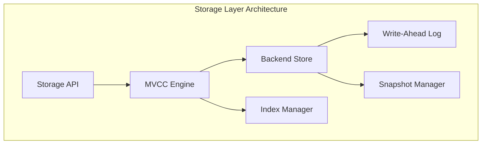
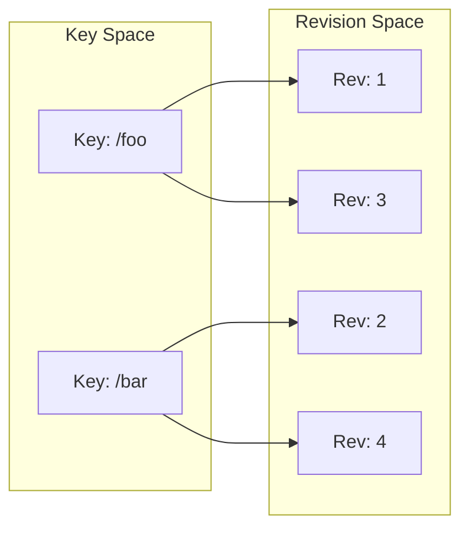
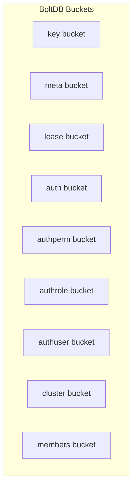
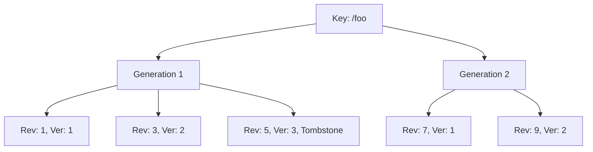

# etcd 存储引擎深度分析

## 概述

etcd 的存储引擎是其核心组件之一，负责数据的持久化、版本管理和事务处理。本文将深入分析 etcd 存储引擎的设计原理和实现细节。

## 存储架构



## 核心组件

### 1. MVCC (Multi-Version Concurrency Control)

**位置**: `server/storage/mvcc/`

MVCC 是 etcd 存储引擎的核心，提供多版本并发控制能力。

```go
type store struct {
    ReadView
    WriteView
    
    // 后端存储
    b backend.Backend
    
    // 索引
    kvindex index
    
    // 当前版本
    currentRev int64
    compactMainRev int64
    
    // 事务相关
    tx backend.BatchTx
    txnID int64
    
    // 同步控制
    mu sync.RWMutex
}
```

**MVCC 数据模型**:



### 2. Backend 存储

**位置**: `server/storage/backend/`

Backend 基于 BoltDB 实现，提供 ACID 事务支持。

```go
type backend struct {
    // BoltDB 实例
    db *bolt.DB
    
    // 批量事务
    batchTx       *batchTxBuffered
    readTx        *readTx
    
    // 配置
    batchInterval time.Duration
    batchLimit    int
    
    // 同步控制
    mu sync.RWMutex
    
    // 钩子函数
    hooks Hooks
}
```

**存储桶结构**:



### 3. 索引管理

**位置**: `server/storage/mvcc/index.go`

索引用于快速查找键的版本信息。

```go
type treeIndex struct {
    tree *btree.BTree
    lg   *zap.Logger
}

type keyIndex struct {
    key         []byte
    modified    revision // 最后修改版本
    generations []generation
}

type generation struct {
    ver     int64
    created revision // 创建版本
    revs    []revision // 所有版本
}
```

**索引结构示例**:



## 数据存储格式

### 1. 键值对存储

etcd 使用复合键来存储数据：

```
Key Format: {revision}{key}
Value Format: {value}{lease_id}{create_revision}{mod_revision}{version}
```

### 2. 版本管理

```go
type revision struct {
    main int64  // 主版本号
    sub  int64  // 子版本号
}

func (a revision) GreaterThan(b revision) bool {
    if a.main > b.main {
        return true
    }
    if a.main < b.main {
        return false
    }
    return a.sub > b.sub
}
```

## 核心操作实现

### 1. Put 操作

```go
func (s *store) Put(key, value []byte, lease lease.LeaseID) *pb.ResponseHeader {
    s.mu.Lock()
    defer s.mu.Unlock()
    
    // 获取当前版本
    rev := s.currentRev + 1
    c := rev
    
    // 检查键是否存在
    oldLease := lease.NoLease
    if ki := s.kvindex.Get(key, rev); ki != nil {
        oldLease = lease.LeaseID(ki.lease)
    }
    
    // 更新索引
    s.kvindex.Put(key, rev)
    
    // 写入后端存储
    ibytes := newRevBytes()
    revToBytes(revision{main: rev}, ibytes)
    
    ver := s.kvindex.KeyIndex(key).Generation(rev).Ver
    kv := mvccpb.KeyValue{
        Key:            key,
        Value:          value,
        CreateRevision: c,
        ModRevision:    rev,
        Version:        ver,
        Lease:          int64(lease),
    }
    
    d, err := kv.Marshal()
    if err != nil {
        plog.Fatalf("cannot marshal event: %v", err)
    }
    
    s.tx.UnsafePut(keyBucketName, ibytes, d)
    s.currentRev = rev
    
    return &pb.ResponseHeader{Revision: rev}
}
```

### 2. Range 操作

```go
func (s *store) Range(key, end []byte, ro RangeOptions) (*RangeResult, error) {
    s.mu.RLock()
    defer s.mu.RUnlock()
    
    return s.rangeKeys(key, end, ro.Limit, ro.Rev, ro.Count)
}

func (s *store) rangeKeys(key, end []byte, limit, rangeRev int64, countOnly bool) (*RangeResult, error) {
    curRev := int64(0)
    if rangeRev <= 0 {
        curRev = s.currentRev
    } else {
        curRev = rangeRev
    }
    
    rev := revision{main: curRev}
    
    // 从索引获取键列表
    keys, total := s.kvindex.Range(key, end, int64(limit))
    
    if countOnly {
        return &RangeResult{Total: total, Rev: curRev}, nil
    }
    
    // 从后端存储读取值
    kvs := make([]mvccpb.KeyValue, len(keys))
    for i, key := range keys {
        kvs[i] = s.rangeKey(key, rev)
    }
    
    return &RangeResult{
        KVs:   kvs,
        Total: total,
        Rev:   curRev,
    }, nil
}
```

### 3. 事务处理

```go
func (s *store) Txn(rt *pb.TxnRequest) (*pb.TxnResponse, error) {
    s.mu.Lock()
    defer s.mu.Unlock()
    
    // 检查条件
    succeeded := s.applyCompares(rt.Compare)
    
    var reqs []*pb.RequestOp
    if succeeded {
        reqs = rt.Success
    } else {
        reqs = rt.Failure
    }
    
    // 执行操作
    resps := make([]*pb.ResponseOp, len(reqs))
    for i, req := range reqs {
        resps[i] = s.applyOp(req)
    }
    
    return &pb.TxnResponse{
        Header:    &pb.ResponseHeader{Revision: s.currentRev},
        Succeeded: succeeded,
        Responses: resps,
    }, nil
}
```

## WAL (Write-Ahead Log)

**位置**: `server/storage/wal/`

WAL 确保数据的持久性和一致性。

```go
type WAL struct {
    dir string // WAL 目录
    
    metadata []byte // 元数据
    state    raftpb.HardState
    start    walpb.Snapshot
    decoder  *decoder
    
    mu      sync.Mutex
    enti    uint64   // 最后写入的索引
    encoder *encoder // 编码器
    
    locks []*fileutil.LockedFile // 文件锁
    fp    *filePipeline          // 文件管道
}
```

**WAL 记录格式**:


## 快照机制

**位置**: `server/storage/mvcc/kvstore_txn.go`

```go
func (s *store) Snapshot() Snapshot {
    s.mu.RLock()
    defer s.mu.RUnlock()
    
    return &snapshot{
        store: s,
        rev:   s.currentRev,
    }
}

type snapshot struct {
    store *store
    rev   int64
}

func (s *snapshot) Range(key, end []byte, ro RangeOptions) (*RangeResult, error) {
    ro.Rev = s.rev
    return s.store.Range(key, end, ro)
}
```

## 压缩机制

```go
func (s *store) Compact(rev int64) (<-chan struct{}, error) {
    s.mu.Lock()
    defer s.mu.Unlock()
    
    if rev <= s.compactMainRev {
        return nil, ErrCompacted
    }
    
    if rev > s.currentRev {
        return nil, ErrFutureRev
    }
    
    start := time.Now()
    
    // 压缩索引
    keep := s.kvindex.Compact(rev)
    
    // 压缩后端存储
    ch := s.scheduleCompaction(rev, keep)
    
    s.compactMainRev = rev
    
    return ch, nil
}
```

## 性能优化

### 1. 批量操作

```go
type batchTxBuffered struct {
    batchTx
    buf txWriteBuffer
}

func (t *batchTxBuffered) Commit() {
    // 批量提交缓冲区中的操作
    t.buf.writeback(&t.batchTx)
    t.batchTx.Commit()
}
```

### 2. 读优化

- 使用 B+ 树索引加速查找
- 实现读写分离
- 支持范围查询优化

### 3. 写优化

- 批量写入减少磁盘 I/O
- 异步刷盘提高吞吐量
- 预分配文件空间

## 监控指标

```go
var (
    rangeCounter = prometheus.NewCounterVec(
        prometheus.CounterOpts{
            Namespace: "etcd",
            Subsystem: "mvcc",
            Name:      "range_total",
        },
        []string{"type"},
    )
    
    putCounter = prometheus.NewCounterVec(
        prometheus.CounterOpts{
            Namespace: "etcd",
            Subsystem: "mvcc",
            Name:      "put_total",
        },
        []string{"type"},
    )
)
```

## 总结

etcd 存储引擎通过以下关键技术实现了高性能和高可靠性：

1. **MVCC 设计** - 支持多版本并发访问
2. **索引优化** - B+ 树索引提供快速查找
3. **事务支持** - ACID 特性保证数据一致性
4. **WAL 机制** - 确保数据持久性
5. **压缩策略** - 控制存储空间增长
6. **批量优化** - 提高 I/O 效率

这些设计使得 etcd 能够在保证数据一致性的同时，提供高性能的读写能力，满足分布式系统对存储的严格要求。
